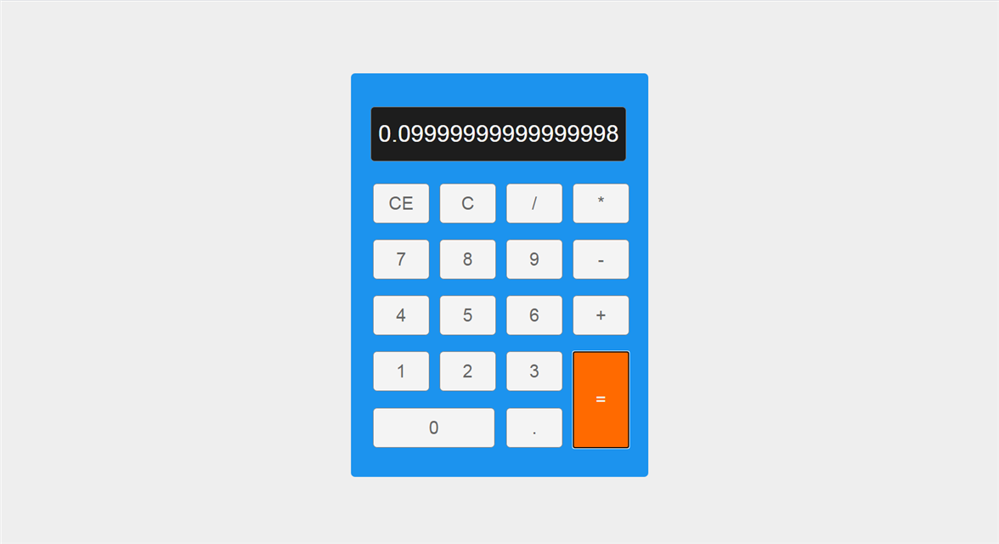

# calculator

| Deadline         | Folder name | Branch name |
| ---------------- | ----------- | ----------- |
| 15.10.2020 23:59 | calculator  | calculator  |

В первую очередь ознакомьтесь с [инструкцией к заданию](introduction.md)

## Task 1. Calculator

Калькулятор - один из лучших проектов для первого знакомства с JavaScript. Такой проект включает в себя достаточно сложные моменты создания пользовательского интерфейса и использования JavaScript для работы с ним, и при этом достаточно прост в выполнении и доступен разработчикам с любым уровнем навыков. Если вы хотите изучить JavaScript или улучшить свои навыки работы с ним, этот проект поможет достичь поставленной цели.

В данном задании предлагаются два исходных проекта - на русском и на английском языке.

Первый рекомендуется студентам, которые только начали знакомство с JavaScript. В нём очень понятное и доступное объяснение. Недостаток этого проекта - несколько устаревший код.

Второй проект намного более современный, в css используются гриды и флексбоксы, в js - классы. Но этот проект сложнее для понимания и вряд ли подойдёт совсем начинающим.

**Обратите внимание!** Если вы пишете свой собственный проект, не используйте в нём функцию eval()

## Исходные проекты

### 1. Калькулятор на JavaScript

- Видео: https://youtu.be/VHGaBc9OcXU (1:21:28)
- Код: https://github.com/irinainina/ready-projects/tree/calculator-ru (94 lines js-code)
- Demo: https://irinainina.github.io/ready-projects/calculator-ru/

Чтобы склонировать проект выполните команду:

`git clone https://github.com/irinainina/ready-projects/ -b calculator-ru`

### 2. Build A Calculator With JavaScript

- Видео: https://youtu.be/j59qQ7YWLxw (38:49)
- Код: https://github.com/irinainina/ready-projects/tree/calculator-en (135 lines js-code)
- Demo: https://irinainina.github.io/ready-projects/calculator-en/

Чтобы склонировать проект выполните команду:

`git clone https://github.com/irinainina/ready-projects/ -b calculator-en`

## Критерии оценки

**Максимальный балл за задание +40**

- Базовая функциональность +10
  - калькулятор выполняет математические операции: сложение, вычитание, умножение, деление. Обязательно наличие десятичной точки, действия с многозначными числами, возможность выполнить несколько действий подряд, очистить результат. По сути калькулятор воспроизводит функциональность исходного проекта. Эта часть задания особых проблем доставить не должна.
- Дополнительные математические операции +10
  - добавьте к четырём перечисленным в предыдущем пункте математическим операциям ещё две: извлечение квадратного корня и возведение в степень. Подсказка: если все кнопки калькулятора сделать одного размера, как раз останется место для добавления ещё двух дополнительных.
- Действия с отрицательными числами +10
  - калькулятор может выполнять действия как с положительными, так и с отрицательными числами. Например, можно поделить -9 на -3. При вводе отрицательного числа перед ним отображается знак "минус". Если у вас реализована операция извлечения квадратного корня, подумайте, как будете обрабатывать попытку найти квадратный корень из отрицательного числа.
- Действия с дробями +10
  - JavaScript не умеет правильно считать дроби. Научите ваш калькулятор это делать. Например, при сложении 0.1 и 0.2 он должен возвращать 0.3

## Instruction to cross-check

Уважаемые проверяющие. Для многих из вас это первая программа на JavaScript. Проверяйте задание без фанатизма. Ваша задача не сломать приложение используя недопустимые числа и операции, а проверить его функциональность на простых примерах, операциях с дву- и трёхзначными числами. Если пункт требований выполнен не полностью, постарайтесь определить какая часть пункта выполнена и поставить соответствующее количество баллов.

#### Примеры вычислений для проверки работоспособности калькулятора и его соответствия критериям

Примеры ориентировочные, числа могут быть другими. Каждое правильно выполненное вычисление оцениваем в 2 балла  
Знак => в примерах означает клик на кнопку калькулятора "равно". Если вычисления выполняются на лету и результат выводится без клика по кнопке "равно", это не является ошибкой.

- **Базовая функциональность**

1.  `1 + 2 => 3`
2.  `23 + 69.5 => 92.5`
3.  `74 * 3 - 5 => 217`
4.  `2 + 3 => 5 продолжаем ввод 4 => 4` - после равно следующая цифра перезаписывает результат
5.  есть кнопка, позволяющая очистить результат

- **Дополнительные математические операции**

1.  `25 √  => 5` или ` √ 25  => 5` - любой вариант правильный
2.  `9 √ + 1  => 4` или ` √ 9 + 1  => 4` - любой вариант правильный
3.  `2 ^ 2 => 4`
4.  `15 ^ 3 => 3375`
5.  `10.1 ^ 3 => 1030.301`

- **Действия с отрицательными числами**

1.  `-9 / -3  => 3`
2.  `2 + -2 => 0`
3.  `2 / -2 => -1`
4.  `-9 ^ 3   => -729`
5.  `-9 √  => уведомление об ошибке` или ` √ - 9 => уведомление об ошибке` - любой вариант правильный

- **Действия с дробями**

1.  `0.1 + 0.2  => 0.3`
2.  `0.4 - 0.1 => 0.3`
3.  `0.0004 + 0.0004 => 0.0008`
4.  `-0.1 * 0.2 => -0.02`
5.  `-0.15 + -0.15  => -0.3` - а не - 0.30

Уважаемые студенты. Если какие-то кнопки у вас работают не так как в предложенных примерах, например, для вычисления квадратного корня нужно указать цифру 2 или кликнуть на равно или для ввода отрицательных чисел используется дополнительная кнопка, напишите инструкцию для проверяющих, как им правильно работать с созданным вами приложением.

## Материалы

- [Видеокурс "Основы программирования"](https://www.youtube.com/playlist?list=PLY4rE9dstrJwoVF-svoIBhKzE-Ok39Zg_)
- [ES6 по-человечески](https://habr.com/ru/post/305900/)
- [Простой калькулятор при помощи HTML/CSS/JS](http://temapetrenko.com/bez-rubriki/prostoj-kalkulyator-pri-pomoshhi-html-css-js-2-chast/)
- [Подборка различных калькуляторов](https://nisnom.com/podborka-razlichnyh-kalkulyatorov-javascript-i-jquery/)
- [Никогда не используйте eval()](https://developer.mozilla.org/ru/docs/Web/JavaScript/Reference/Global_Objects/eval)

Документ для вопросов: https://docs.google.com/spreadsheets/d/1dMDLBC4-1XPaVMehZB6DqetToXZhq4x0PiZtj-jvLRc/

Ссылки на лучшие работы, добавьте, пожалуйста, в эту форму https://forms.gle/4uUvCsJ1WWXPJHCg7

## Cross-check

- инструкция по проведению cross-check: https://docs.rs.school/#/cross-check-flow
- форма для проверки задания: https://calculator-cross-check.netlify.app/
