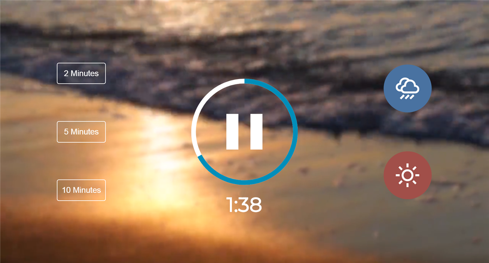

# meditation-app

Ознакомиться с описанием задания можно по [ссылке](introduction.md)

## Task 3. Meditation App +40

- В интернете много приложений для релаксации и медитации
  - http://ecosounds.net/
  - http://7oom.ru/penie-ptic.html
  - http://www.allolo.ru/?id=32
  - http://ornitoterapiya.ru/solo/solovey.html
    Автор предлагает создать подобный сайт самостоятельно. Пользователи могут выбирать различные таймеры и звуки.
- Чему вы научитесь: работать с таймерами, видео, аудио в JavaScript
- Видео: https://youtu.be/oMBXdZzYqEk (45:01)
- Код: https://github.com/developedbyed/meditation-app (82 lines js-code)
- Demo: https://relacsed-app.netlify.app/
- Время выполнения: 8 часов

## Материалы:

- Выполняем проект на JavaScript. Таймер https://youtu.be/ZdKkymfX4vo
- JavaScript Video Player https://youtu.be/n8dvAcf2c98

Документ для вопросов: https://docs.google.com/spreadsheets/d/1dMDLBC4-1XPaVMehZB6DqetToXZhq4x0PiZtj-jvLRc/

Ссылки на лучшие работы, добавьте, пожалуйста, в эту форму https://forms.gle/4uUvCsJ1WWXPJHCg7
