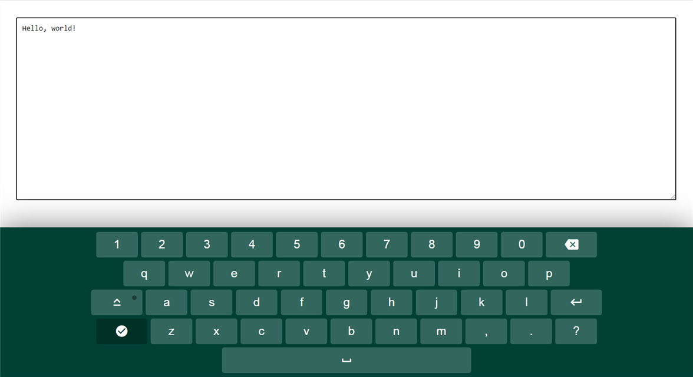

# virtual-keyboard

| Deadline         | Folder name      | Branch name      |
| ---------------- | ---------------- | ---------------- |
| 01.11.2020 23:59 | virtual-keyboard | virtual-keyboard |

В первую очередь ознакомьтесь с [инструкцией к заданию](introduction.md)

## Task 3. Virtual Keyboard

Проект по созданию виртуальной клавиатуры. Хороший современный код, понятное объяснение. Выполняя проект вы усовершенствуете навыки работы с DOM, сможете познакомиться и поработать с экспериментальной технологией распознавания голоса - SpeechRecognition.

- Видео: https://youtu.be/N3cq0BHDMOY (1:02:31)
- Код: https://github.com/irinainina/ready-projects/tree/virtual-keyboard (177 lines js-code)
- Demo: https://irinainina.github.io/ready-projects/virtual-keyboard/

Чтобы склонировать проект выполните команду:

`git clone https://github.com/irinainina/ready-projects/ -b virtual-keyboard`

## Критерии оценки

**Максимальный балл за задание +60**

- Базовая функциональность +12
  - воспроизводится функциональность исходного проекта: при клике мышкой по клавишам с символами, эти символы отображаются в окне ввода, есть клавиша CapsLock, переводящая все буквы в верхний регистр, клавиша пробел, клавиша Backspace, удаляющая символы перед курсором, клавиша Enter для перехода на новую строку, клавиатуру можно скрыть и отобразить на экране. В окне для ввода текста сохраняются все возможности обычной физической клавиатуры: текст можно набирать, выделять, удалять, добавлять текст в средину строки и т.д. Отличие от исходного проекта: в окне для ввода текста отображается текущая позиция курсора в виде вертикальной мигающей черточки.
- Клавиша Shift +8
  - клавиша Shift работает как в обычной клавиатуре - меняет регистр букв, выводит дополнительные символы вместо цифр и символов основной раскладки. Переключение клавиши Shift происходит по клику, при этом меняется состояние клавиши (активная-неактивная), на клавиатуре отображаются соответствующие символы.
- Смена языка en/ru +8
  - для смены языка добавлена дополнительная клавиша en/ru, при клике по которой происходит переключение между русской и английской раскладкой клавиатуры. При переключении языка на клавише en/ru отображается установленный в данный момент язык, на других клавишах клавиатуры отображаются символы выбранного языка
- Горизонтальные стрелки для перемещения в пределах строки +8
  - для перемещения в пределах строки добавлены стрелки влево-вправо клики по которым реализуют горизонтальную навигацию позиции курсора. После перемещения позиции курсора ввод/удаление текста происходит по позиции курсора в т.ч. внутри строки. Вертикальная навигация не требуется и не оценивается, реализовать её можно по собственному желанию.
- Дополнительная функциональность.
  Виртуальная клавиатура - отличный таск для добавления в портфолио. Для его большей презентабельности можно изменить (улучшить) дизайн клавиатуры, а также реализовать следующие функции:
  - подсветка клавиш виртуальной клавиатуры при кликах по клавишам физической клавиатуры \* +6
  - озвучивание нажатия клавиш виртуальной клавиатуры +6
  - клавиатура адаптируется под размер страницы +4
  - голосовой ввод текста \*\* +8

\* Подсветка - это изменение стиля клавиши при клике (цвет, прозрачность, тень и т.д). [Пример подсветки](https://wonderful-swartz-d8b98d.netlify.app/)  
\*\* В качестве примера можно посмотреть как работает голосовой ввод текста в Google Документы ([Google Документы](https://docs.google.com/document/u/0/) => Пустой файл => Инструменты => Голосовой ввод)

## Instruction to cross-check

- каждый выполненный пункт - +2 балла. В блоке **Горизонтальные стрелки для перемещения в пределах строки** каждый выполненный пункт - +4 балла

- **Базовая функциональность**
  - при клике мышкой по клавишам с символами, эти символы отображаются в окне ввода текста. Есть клавиша пробел
  - есть клавиша CapsLock, переводящая все буквы в верхний регистр. Активное и неактивное состояние клавиши отличаются визуально
  - есть клавиша Backspace, удаляющая символы перед курсором. Есть клавиша Enter для перехода на новую строку
  - клавиатуру можно скрыть и отобразить на экране
  - в окне для ввода текста сохраняются все возможности обычной физической клавиатуры: текст можно набирать, выделять, удалять, добавлять текст в средину строки и т.д. При вводе текста с физической клавиатуры, текст может набираться как на языке виртуальной клавиатуры (предпочтительный вариант), так и на языке, который в данный момент указан в операционной системе
  - в окне для ввода текста отображается текущая позиция курсора в виде вертикальной мигающей чёрточки
- **Клавиша Shift**
  - клавиша Shift меняет регистр букв - строчные переводит в заглавные, заглавные (при зажатой CapsLock) переводит в строчные
  - клавиша Shift позволяет выводить дополнительные символы вместо цифр и символов основной раскладки
  - активное и неактивное состояние клавиши Shift отличаются визуально
  - переключение клавиши Shift происходит по клику, аналогично тому, как переключается состояние клавиши CapsLock в исходном проекте
- **Смена языка en/ru**
  - для смены языка добавлена дополнительная клавиша en/ru, при клике по которой происходит переключение между русской и английской раскладкой клавиатуры
  - при переключении языка на клавише en/ru отображается установленный в данный момент язык
  - при переключении языка на других клавишах клавиатуры отображаются символы выбранного языка, при кликам по ним эти символы выводятся в окно для ввода текста
  - при зажатой клавише Shift на клавишах отображаются и в окне для ввода текста выводятся дополнительные символы соответствующей раскладки
- **Горизонтальные стрелки для перемещения в пределах строки**
  - для перемещения в пределах строки добавлены стрелки влево-вправо клики по которым реализуют горизонтальную навигацию курсора. Визуально позиция курсора отображается в виде вертикальной мигающей чёрточки
  - после перемещения позиции курсора ввод/удаление текста происходит по текущей позиции курсора в т.ч. внутри строки
- **Подсветка клавиш виртуальной клавиатуры при кликах по клавишам физической клавиатуры**
  - нажатие на клавиши физической клавиатуры подсвечивает соответствующие алфавитно-цифровые клавиши, клавиши с символами, клавишу пробел виртуальной клавиатуры
  - символы нажатых алфавитно-цифровых клавиш, клавиш с символами и пробел выводятся в окне для ввода текста
  - нажатие на клавиши Shift, CapsLock, Backspace, Enter физической клавиатуры подсвечивает соответствующие клавиши виртуальной клавиатуры, переводит клавиши Shift и CapsLock в активное состояние, производит то же действие, которое происходит при кликах по клавишам Shift, CapsLock, Backspace, Enter мышкой (смена регистра, удаление символа, переход на новую строку и т.д).
- **Озвучивание нажатия клавиш**
  - при печати на виртуальной клавиатуре воспроизводится звук пишущей машинки, или другие звуки. Если звуки воспроизводятся и при печати на реальной клавиатуре, это не является ошибкой.
  - звуки при печати в русской и английской раскладке отличаются. Предусмотрены уникальные звуки для клавиш Shift, CapsLock, Backspace, Enter
  - есть возможность включить и отключить озвучивание нажатия клавиш, для этого на виртуальной клавиатуре предусмотрена отдельная клавиша. Активное и неактивное состояние данной клавиши отличается визуально и переключается кликом.
- **Клавиатура адаптируется под размер страницы**
  - размер клавиш виртуальной клавиатуры и шрифта на них адаптируется под размер экрана. Минимальная ширина страницы, при которой проверяется корректность отображения и работы клавиатуры - 500рх
  - размер шрифта на клавишах не меньше 14рх, достаточная контрастность шрифта и фона клавиш в активном и неактивном состоянии [Colour contrast checking tools](https://www.bl2.ru/programing/colourcontrastcheck.html)
- **Голосовой ввод текста**
  - на виртуальной клавиатуре есть отдельная клавиша, при клике по которой можно включить/отключить голосовой ввод текста. Активное и неактивное состояние клавиши отличаются визуально
  - если голосовой ввод текста включён, в окне для ввода текста выводится текст, который поступает на устройство записи звука (например, микрофон или стереомикшер) указанное в настройках операционной системы
  - язык распознавания голоса en/ru меняется при переключении языка виртуальной клавиатуры
  - голосовой ввод текста продолжается до тех пор, пока активна клавиша голосового ввода

## Материалы

- DOM https://learn.javascript.ru/document
- DOM https://youtu.be/TewWd-6ZrmE
- DOM Events https://youtu.be/vcXehC9JgGU

## Live Coding

- Virtual Keyboard (part 1) https://youtu.be/nuQW_cBLR6Q
- Virtual Keyboard (part 2) https://youtu.be/dAxI351AhCg
- Live coding project repo https://github.com/xmelsky/virtual-keyboard-live

## Голосовой ввод текста

- SpeechRecognition https://developer.mozilla.org/ru/docs/Web/API/SpeechRecognition
- демо https://js3020.github.io/
- видео https://youtu.be/0mJC0A72Fnw
- код https://github.com/wesbos/JavaScript30/tree/master/20%20-%20Speech%20Detection

## Озвучивание нажатия клавиш

- демо https://js3001.github.io/
- видео https://youtu.be/VuN8qwZoego
- код https://github.com/wesbos/JavaScript30/tree/master/01%20-%20JavaScript%20Drum%20Kit

## Virtual keyboard design

- https://codepen.io/bernardo/full/AivJp
- https://codepen.io/ethanbustad/full/LxsIi
- https://codepen.io/iamsainikhil/full/gdYmOQ

Документ для вопросов: https://docs.google.com/spreadsheets/d/1dMDLBC4-1XPaVMehZB6DqetToXZhq4x0PiZtj-jvLRc/

## Cross-check

- инструкция по проведению cross-check: https://docs.rs.school/#/cross-check-flow
- форма для проверки задания: https://virtual-keyboard-cross-check.netlify.app/
- cсылки на лучшие работы добавьте, пожалуйста, в эту форму https://forms.gle/v8EoNu1QjU1otUxg7
