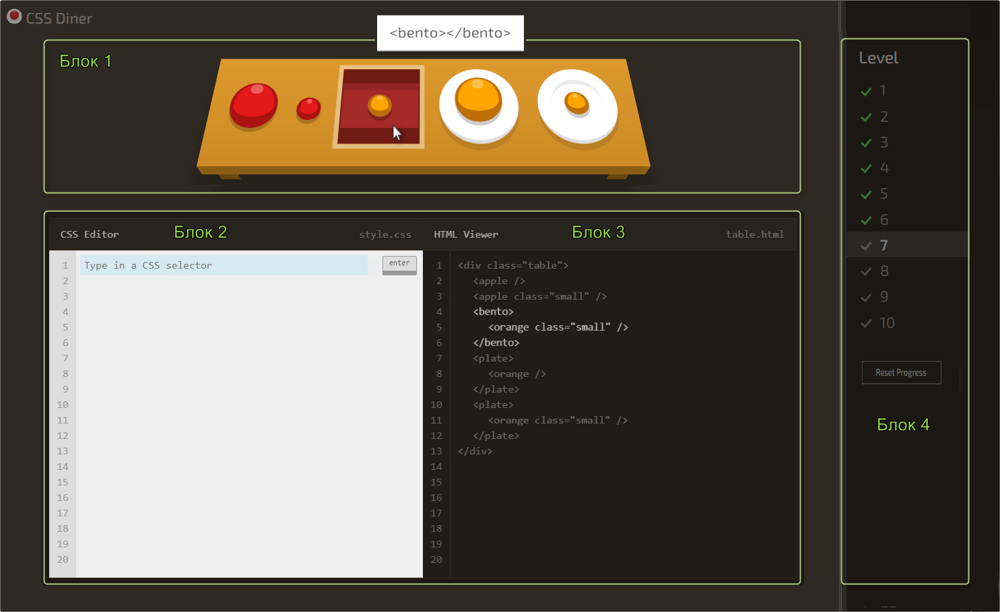

# RS Селекторы

В этом задании мы создадим тренажер для изучения css-селекторов. Тренажер состоит из нескольких игровых уровней. Каждый уровень включает в себя пример вёрстки и html-код, который отвечает текущему уровню. Некоторые элементы вёрстки выделены при помощи анимации. Задача пользователя - написать css-селектор, отвечающий всем выделенным элементам вёрстки.

Прототип тренажера - приложение [CSS Diner](https://flukeout.github.io/), из которого необходимо воспроизвести только игровую часть. Перед началом выполнения задания внимательно ознакомьтесь с особенностями работы приложения-прототипа, это ускорит выполнение задания и облегчит понимание его требований.

## Структура приложения

- Блок 1. Пример вёрстки. На оригинальном сайте это стол с посудой и продуктами. Вы можете придумать и использовать свой вариант оформления.
- Блок 2. Окно для ввода кода пользователем.
- Блок 3. Код вёрстки. При наведении курсора на фрагмент кода, подсвечивается отвечающий этому фрагменту элемент вёрстки. При наведении курсора на элемент вёрстки, подсвечивается соответствующий ему фрагмент в блоке с кодом. В обоих перечисленных случаях рядом с элементом отображается его html-код
- Блок 4. Список уровней игры. На оригинальном сайте тридцать два уровня, вам достаточно выполнить десять-двадцать уровней. Большее количество уровней можно сделать по желанию и при наличии свободного времени.

## Ключевые навыки:

- **TypeScript**
- Modules
- Webpack

## Работа приложения

- в окне для ввода кода пользователь может напечатать и отправить на проверку css-селектор, который соответствует всем выделенным элементам вёрстки. Отправить код на проверку можно как кликом по кнопке Enter в окне для ввода кода, так и нажатием клавиши Enter на клавиатуре (оба варианта должны работать)
- для правильных и неправильных ответов предусмотрена соответствующая анимация. В оригинальном приложении при правильном ответе происходит вылет выделенных элементов за пределы экрана, при неправильном ответе - подёргивание окна с кодом. Вы можете использовать другую анимацию, на ваш взгляд более уместную и привлекательную
- при правильном ответе пользователь переходит на следующий уровень игры, или выводится уведомление о победе, если уровень последний
- в приложении есть кнопка Help для тех случаев, когда пользователь не может угадать нужный селектор. Клик по кнопке Help выводит нужный селектор в окне для ввода кода. Селектор выводится в блоке для ввода кода с эффектом печати текста (плавное появление текста по буквам)
- в блоке со списком уровней игры есть возможность переходить к определённому уровню кликая по его номеру; возле каждого уровня отображается, выполнен он, или нет, или уровень выполнен с использованием подсказки. Текущий уровень подсвечен. При перезагрузке приложение открывается на этом же уровне. Есть кнопка, позволяющая сбросить прогресс и начать прохождение игры заново

## Требования к репозиторию

- задание выполняется в приватном репозитории школы [Как работать с приватным репозиторием](https://docs.rs.school/#/private-repository?id=Как-работать-с-приватным-репозиторием). Если у вас нет приватного репозиторий школы, задание можно выполнять в личном приватном репозитории.
- в приватном репозитории создайте ветку с названием задания, в ней создайте папку с названием задания, и в ней разместите файлы проекта
- для деплоя используйте `gh-pages` [Как сделать деплой задания из приватного репозитория школы](https://docs.rs.school/#/private-repository?id=Как-сделать-деплой-задания-из-приватного-репозитория-школы). Если вы не можете задеплоить проект на `gh-pages`, для деплоя можно использовать https://app.netlify.com/drop  
  Для демоверсий, размещённых на `netlify`, название страницы дайте по схеме: имя гитхаб аккаунта - название таска
- история коммитов должна отображать процесс разработки приложения. [Требования к коммитам](https://docs.rs.school/#/git-convention)
- после окончания разработки необходимо сделать Pull Request из ветки приложения в ветку `main` [Требования к Pull Request](https://docs.rs.school/#/pull-request-review-process?id=Описание-pull-request-должно-содержать-следующую-информацию). **Мержить Pull Request не нужно**

## Как сабмитить задание

Засабмитить задание необходимо как можно раньше, как только в rs app появится такая возможность. Для этого зайдите в rs app https://app.rs.school/, выберите пункт Cross-Check: Submit, в выпадающем списке выберите название таска, в поле Solution URL добавьте ссылку на задеплоенную версию вашего приложения, нажмите кнопку Submit.  
После сабмита задания его можно продолжать выполнять до самого дедлайна.

## Требования к оформлению приложения

- внешний вид приложения соответствует предложенному образцу или является его улучшенной версией
- для стандартных разрешений экрана монитора до 1024×768 включительно, приложение полностью помещается в экран без появления полосы прокрутки. При меньшем разрешении экрана может появиться вертикальная полоса прокрутки. Минимальная ширина страницы, при которой проверяется корректность отображения приложения - 500рх
- интерактивность элементов, с которыми пользователи могут взаимодействовать, изменение внешнего вида самого элемента и состояния курсора при наведении, использование разных стилей для активного и неактивного состояния элемента, плавные анимации
- в футере приложения есть ссылка на гитхаб автора, год создания приложения, [логотип курса](https://rs.school/images/rs_school_js.svg) со [ссылкой на курс](https://rs.school/js/)

## Технические требования

- для написания кода приложения используется TypeScript.
- код разбит на модули.
- для сборки кода используется `webpack`.
- используется `eslint`, настроенный для проверки TypeScript.
- работа приложения проверяется в браузере Google Chrome последней версии
- можно использовать [bootstrap](https://getbootstrap.com/), [material design](https://material.io/) и другие css-фреймворки, html и css пост/препроцессоры.
- запрещается использовать jQuery
- запрещается использовать Angular/React/Vue и/или подобные им фреймворки/библиотеки.
- можно использовать js-библиотеки для подсветки кода (highlight.js, CodeMirror, Ace etc.)

## Критерии оценки:

### Кросс-чек

**Максимальный балл за задание: 150 баллов при кросс-чеке / 200 баллов при проверке ментором**

#### Basic scope +70

- [ ] вёрстка, дизайн, UI. Внешний вид приложения соответствует приложению-прототипу или является его улучшенной версией. Выполняются требования к оформлению приложения +10
- [ ] используются собственные оригинальные интересные разнообразные задания на нахождение css-селекторов. Количество заданий не меньше десяти +10
- [ ] выполнен блок 1 с примером вёрстки. Элементы, для которых необходимо написать css-селектор, выделены при помощи анимации +10
- [ ] выполнен блок 2 с окном для ввода кода пользователем. В окне для ввода кода можно напечатать css-селектор +10
- [ ] выполнен блок 3 с кодом вёрстки, в котором отображается код вёрстки +10
- [ ] выполнен блок 4 со списком уровней игры. У пользователя есть возможность переходить к определённому уровню кликая по его номеру +10
- [ ] текущий уровень подсвечен. При перезагрузке приложение открывается на этом же уровне +10

#### Advanced scope +80

- [ ] подсветка html и css-кода в блоках 2 и 3 - окне для ввода кода пользователем и блоке с кодом вёрстки. Для подсветки кода могут использоваться js-библиотеки +10
- [ ] при наведении курсора на строку в блоке с кодом, отвечающий этой строке элемент в блоке с примером вёрстки подсвечивается. Рядом с элементом отображается его html-код +10
- [ ] при наведении курсора на элемент в блоке с вёрсткой, подсвечивается соответствующий ему фрагмент в блоке с кодом. Рядом с элементом отображается его html-код +10
- [ ] введённые пользователем селекторы можно отправить на проверку как кликом по кнопке Enter в окне для ввода кода, так и нажатием клавиши Enter на клавиатуре (срабатывает даже если фокус не на инпуте). Отправленные на проверку селекторы проверяются на соответствие требованиям задания +10
- [ ] проверку проходят любые селекторы, отвечающие всем выделенным элементам. +10
- [ ] если пользователь ввёл правильный css-селектор, отвечающий всем выделенным элементам - отображается соответствующая анимация и автоматически открывается следующий уровень игры или выводится уведомление о победе, если уровень последний. В сообщении о победе написано, что все уровни / селекторы пройдены. Если пользователь перешёл к последнему уровню, не проходя несколько или все предыдущие - при правильном селекторе в сообщении о победе выводится сколько уровней / селекторов пройдено. Если пользователь ответил неправильно, отображается соответствующая анимация. +10
- [ ] в приложении есть кнопка Help для тех случаев, когда пользователь не сумеет угадать нужный селектор. Клик по кнопке Help выводит нужный селектор в окне для ввода кода. Селектор выводится с эффектом печати текста (плавное появление текста по буквам) +10
- [ ] возле каждого уровня игры отображается, выполнен он, или нет, или уровень выполнен с использованием подсказки. Есть кнопка, позволяющая сбросить прогресс и начать прохождение игры заново +10

### Проверка ментором

**Максимальный балл за задание +200**

1. Репозиторий +20
   - pull request выполнен в соответствии с [требованиями](https://docs.rs.school/#/pull-request-review-process?id=Требования-к-pull-request-pr) +10
   - ведётся история коммитов, названия коммитов даются согласно [гайдлайну](https://docs.rs.school/#/git-convention) +10
2. Качество кода +160
   - приложение написано на TypeScript.
     - используется Everyday Types +10
     - используются Generics +10
     - использование Object Types +10
     - использование Classes +10
     - использование Function +10
     - нигде не используется тип Any +10
     - ESLinter настроен на TypeScript (используется плагин `typescript-eslint/recommended`) и отсутствуют ошибки +10
     - В конфигурационном файле TypeScript стоят флаги `"noImplicitAny": true` и `"strict": true` + 20
     - webpack, eslint настроен и работает с TypeScript +10
   - дублирование кода сведено к минимуму, не используются магические числа, используются осмысленные имена переменных и функций, оптимальный размер функций и т.д. +10
   - код разбит на модули +10
   - динамическое добавление новых компонентов средствами JavaScript(в зависимости от приложения возможны: определенные элементы игры, новые уровни, карточки элементов/товаров) +10
   - в таске не использованы querySelector, querySelectorAll, getElementById, getElementByClassName +30
3. Тесты в приложении +20
   - реализованы юнит-тесты, использующие различные методы jest – 2 балла за каждую покрытую функцию/метод, но не более 20 баллов (процент покрытия каждой функции/метода не учитывается)

## Штрафы ментора.

1. Не используется TypeScript - 200.
2. Используется тип Any -40
3. Код не полностью покрыт типами -20
4. В конфигурационном файле ESLint не включено правило `no-explicit-any` -10
5. Не все замечания ментора после code review исправлены - штраф до 70%

Запрещено копировать код других студентов, демо, примеров, которые приводятся в задании. Этот запрет касается html, css, js кода. Можно использовать небольшие фрагменты кода со Stack Overflow, других самостоятельно найденных источников в интернете, за исключением github-репозиториев студентов курса. Возле использованного чужого фрагмента кода в комментарии указывается ссылка на источник.

## Полезные материалы

- **Typescript**

  - [Официальная документация TypeScript](https://www.typescriptlang.org/)
  - [Руководство по TypeScript](https://metanit.com/web/typescript/)
  - [Практическое руководство по TypeScript для разработчиков](https://habr.com/ru/company/macloud/blog/557996/)
  - [TypeScript. Полный курс](https://youtu.be/5QnZ9AyDW6c)
  - [TypeScript - Быстрый Курс за 70 минут](https://youtu.be/nyIpDs2DJ_c)

- **Webpack**

  - [Сборка webpack студента предыдущего набора](https://github.com/Net-zen/webpack-boilerplate)
  - [Webpack для начинающих](https://youtu.be/7i_jF66F1xM)
  - [(Очень простое) Руководство для начинающих по webpack](https://techrocks.ru/2020/10/03/webpack-guide-for-beginners/)
  - [Настройка Webpack 5 с нуля](https://habr.com/ru/post/524260/)

- **Библиотеки для подсветки кода**

  - [highlight.js — лучшая подсветка синтаксиса кода](https://wiki.pwodev.com/highlight-js-лучшая-подсветка-кода/)
  - [Code Mirror - динамичная подсветка кода в браузере](http://www.druweb.ru/code-mirror.html)

- **Советы по качеству кода**

  - [Магические числа](https://ru.code-basics.com/languages/javascript/modules/variables/lessons/magic-numbers)
  - [Как писать чистый код: обзор лучших практик JavaScript](https://techrocks.ru/2019/08/27/writing-clean-code-in-javascript/)
  - [Рекомендации по написанию чистого кода на JavaScript](https://habr.com/ru/company/ruvds/blog/454520/)

- **Unit tests**

  - [testing module](https://github.com/rolling-scopes-school/tasks/tree/master/stage2/modules/testing)
  - [jest-dom documentation](https://testing-library.com/docs/ecosystem-jest-dom/)

## Вебинары RS School

- [JS/FE 2021Q3 Typescript Basics](https://youtu.be/BRTT8ZJeoS4)
- [Typescript 26.05.21 (part 1)](https://youtu.be/I_aTbZcH8Do)
- [Typescript 28.05.21 (part 2)](https://youtu.be/CegrbRXGw20)
