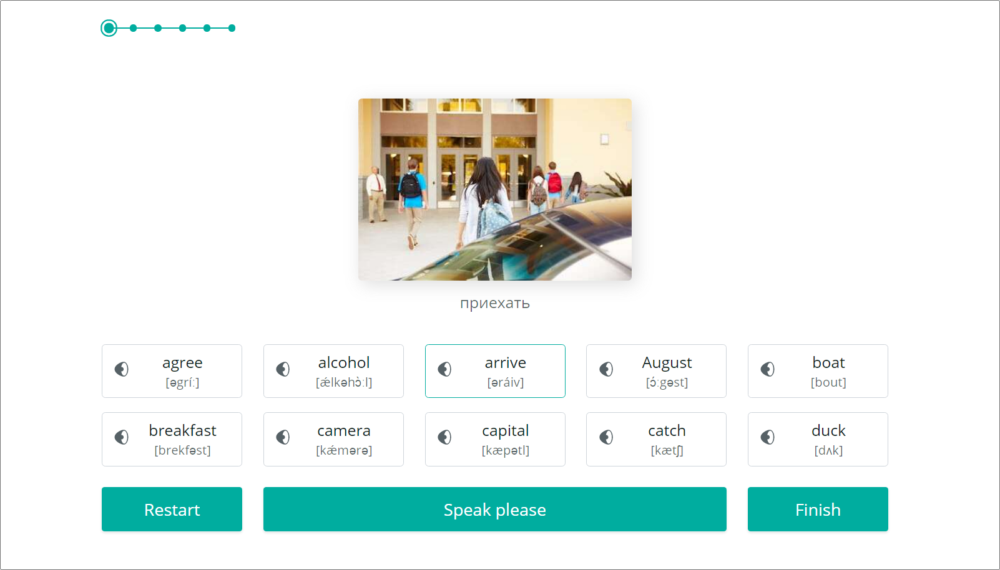

# EnglishPuzzle

| Deadline         | Branch name    | Folder name    |
| ---------------- | -------------- | -------------- |
| 07.06.2020 23:59 | english-puzzle | english-puzzle |

**English-puzzle** - мини-игра, цель которой собирать предложения из размещённых в случайном порядке английских слов.

Прототип приложения - тренировка Конструктор фраз сайта Lingualeo `https://lingualeo.com/ru/training/phrasePuzzle`

Чтобы протестировать работу прототипа, зарегистрируйтесь на Lingualeo и добавьте в Словарь предложения из [Разговорников](https://lingualeo.com/ru/dictionary/sets-recommended-phrasebooks).

## Отличия от прототипа

- наличие стартового экрана
- интерфейс приложения выполнен на английском языке
- возможность выбора одной их трёх подсказок:
  - перевод предложения
  - произношение предложения
  - полупрозрачный фоновый рисунок на карточках со словами
- карточки со словами являются фрагментами картины и выглядят как элементы пазла
- в поле для вывода результатов отображаются все десять собранных в текущем раунде предложений
- ширина всех предложений одинаковая
- когда все десять предложений собраны, фоновый рисунок карточек со словами образует картину

## Структура приложения

- стартовый экран
- страница приложения
  - меню
  - блок с подсказками
  - блок с результатами
  - блок с исходными данными
  - кнопки "I don't know", "Check", "Continue", "Results"
- страница статистики

## Макет приложения:

## Исходные данные

Коллекция из 3600 часто употребляемых английских слов, отсортированных в порядке возрастания сложности. Вся коллекция разбита на шесть частей по 600 слов в каждой. В коллекции приводятся примеры предложений - textExample, которые используются в этой игре. Перевода предложений в исходных данных нет, для их получения используйте translation API.

## Описание функциональных блоков

- стартовый экран содержит название приложения, краткую инструкцию, кнопку Start game
- в меню можно выбрать уровень сложности и раунд игры, включить и отключить автопроизношение, выбрать используемые в игре подсказки
- в блоке с подсказками могут находиться перевод предложения и иконка аудио
- в блоке с результатами собираются предложения и находятся уже собранные предложения. Для каждого предложения отводится одна строчка. Ширина всех предложений одинаковая.
- в блоке с исходными данными в случайном порядке размещаются карточки со словами, из которых можно собрать предложение. Там, где карточки соприкасаются между собой, у них есть фигурные вырезы, как у пазлов. Фон каждой карточки является фрагментом картины.
- на странице статистики отображаются все предложения раунда с их переводами и иконкой аудио. При клике по предложению звучит его произношение.

## Работа приложения

- приложение открывается со стартового экрана. При клике по кнопке "Start game" открывается основной экран приложения
- в игре 6 уровней сложности по количеству частей коллекции исходных данных, в каждом уровне 60 раундов по 10 предложений в каждом. Игра начинается с раунда 1.1 или с того, на котором закончил предыдущую игру пользователь
- в меню по умолчанию включено автопроизношение и подсказка перевод предложения
- выбор подсказки указывает на то, когда появится соответствующая функциональность - до того, как будет собрано предложение, или после. Например, если выбраны все три подсказки, до того как собрано предложение пользователь может прослушать произношение предложения, увидеть его перевод, на карточках со словами отображается фоновый рисунок. После того, как собрано предложение, звучит сигнал "сorrect". Если все три подсказки отключены, произношение предложения, перевод и фоновый рисунок на карточках отображаются после того, как предложение собрано.
- при клике по словам в блоке с исходными данными, они помещаются в блок с результатами в том порядке, в котором по ним кликали
- слова можно перетягивать мышкой, при этом слово может помещаться в начало или в конец предложения, или между уже добавленными словами
- когда все слова перемещены в поле для вывода результатов, кнопка "I don't know" меняется на кнопку "Check"
- при клике по кнопке "Check"
  - если предложение собрано верно, все карточки со словами подсвечиваются зелёным цветом, отображаются неиспользованные подсказки, кнопка "Check" меняется на кнопку "Continue"
  - если предложение собрано неверно, те слова, которые находятся на своих позициях подсвечиваются зелёным, слова, которые находятся не на своих позициях, подсвечиваются красным, рядом с кнопкой "Check" появляется кнопка "I don't know"
- при клике по кнопке "I don't know" слова размещаются в правильном порядке, образуя предложение, отображаются неиспользованные подсказки, кнопки "Check" и "I don't know" меняются на кнопку "Continue"
- при клике по кнопке "Continue" происходит переход к следующему предложению: в поле с исходными данными появляются новые слова, из которых можно составить следующее предложение, в поле для вывода результатов подсвечивается следующая строка, в которой можно собрать предложение
- Когда собраны все десять предложений, границы между карточками и слова на них исчезают, фоновый рисунок карточек становится непрозрачным, пользователь может увидеть картину а также краткие сведения о ней: автор, название, год создания. Рядом с кнопкой "Continue" появляется кнопка "Results"
- при клике по кнопке "Results" отображается страница статистики. В разделе статистики "I know" находятся предложения, которые пользователь сумел собрать правильно, вне зависимости от количества попыток и используемых подсказок, в разделе "I don't know" - предложения, которые пользователь открыл кликом по одноимённой кнопке
- на странице статистики есть кнопка "Continue", при клике по ней открывается следующий раунд игры

## Требования к репозиторию

- для разработки приложения используйте приватный репозиторий школы. [Как работать с приватным репозиторием](https://docs.rs.school/#/stage2?id=Как-работать-с-приватным-репозиторием)
- история коммитов должна отображать процесс разработки приложения. [Требования к коммитам](https://docs.rs.school/#/git-convention)
- демо-версия приложения размещается на `https://www.netlify.com/`, либо на другом подобном хостинге. Название страницы с демо-версией даёте по схеме: имя гитхаб аккаунта-название таска.
- после окончания разработки или при наступлении дедлайна, создайте pull request из ветки english-puzzle в ветку master. [Требования к pull request](https://docs.rs.school/#/stage2?id=Описание-pull-request-должно-содержать-следующую-информацию). Мержить pull request не нужно.
- приложение проверятся ментором и другими студентами (кросс-чек)
- для проверки приложения в ходе кросс-чека ссылку на демо-версию приложения необходимо будет добавить в rs-app

## Технические требования

- работа приложения проверяется в браузере Google Chrome последней версии
- использование jQuery не допускается
- использование Angular / React / Vue только по личной договорённости с ментором
- необходимо использовать webpack, eslint, eslint-config-airbnb-base, babel
- можно использовать bootstrap, css фреймворки, html и css препроцессоры

## Критерии оценки:

**Максимальный балл за задание: 200 баллов при кросс-чеке / 200 баллов при проверке ментором**

### Basic scope +70

- [ ] стартовый экран содержит название приложения, краткую инструкцию, кнопку Start game. После клика по кнопке Start game открывается основной экран приложения +10
- [ ] вёрстка, дизайн, UI основного экрана приложения. Интерактивность кликабельных элементов, различные стили для активного и неактивного состояния +10
- [ ] карточки со словами выводятся в случайном порядке +10
- [ ] при клике по карточкам со словами в блоке с иходными данными, они перемещаются в блок с результатами в том порядке, в котором по ним кликали +10
- [ ] при клике по кнопке "Check", те карточки со словами, которые находятся на своих позициях подсвечиваются зелёным, карточки, которые находятся не на своих позициях, подсвечиваются красным +10
- [ ] при клике по кнопке "I don't know" слова размещаются в правильном порядке, образуя предложение, отображаются неиспользованные подсказки
- [ ] если предложение собрано верно, кнопка "Check" меняется на кнопку "Continue". При клике по кнопке "Continue" происходит переход к следующему предложению +10

### Advanced scope +90

- [ ] можно выбрать уровень сложности и раунд игры +10
- [ ] последний пройденный раунд сохраняется в local storage, после запуска игра начинается со следующего за ним раунда +10
- [ ] можно включить и отключить автопроизношение +10
- [ ] можно выбрать подсказку перевод предложения +10
- [ ] можно выбрать подсказку произношение предложения +10
- [ ] можно выбрать подсказку фоновый рисунок на карточках со словами +10
- [ ] слова можно перетягивать мышкой, при этом слово в блоке с результатами может помещаться в начало или в конец предложения, или между уже добавленными словами +10
- [ ] на странице статистики отображаются все предложения раунда с их переводами и иконкой аудио. При клике по предложению звучит его произношение +10
- [ ] на странице статистики есть разделы "I know" и "I don't know" и кнопка "Continue" +10

### Hacker scope +40

- [ ] карточки со словами выглядят как элементы пазла.Там, где карточки соприкасаются между собой, у них есть фигурные вырезы, как у пазлов +10
- [ ] каждому из 360 раундов игры соответствует своя уникальная картина - знаменитое произведение живописи\*. Когда собраны все десять предложений раунда, границы между карточками и слова на них исчезают, фоновый рисунок карточек становится непрозрачным, пользователь может увидеть картину а также краткие сведения о ней: автор, название, год создания +10
- [ ] ведётся долгосрочная статистика мини-игры, можно посмотреть когда (дата и время) и с каким результатом в неё играли. После перезагрузки приложения статистика сохраняется. Для хранения статистики используется бекэнд +10
- [ ] если бекэнд не работает или возвращает ошибку, приложение не ломается и работает исправно. Долгосрочная статистика кнопка для перехода к ней не отображаются   +10

\*Для составления коллекции, состоящей из 360 шедевров живописи можно объединить усилия студентов курса.

## Cross-check

- инструкция по проведению cross-check: https://docs.rs.school/#/cross-check-flow
- форма для проверки задания: https://cross-check-english-puzzle.netlify.app/

## Материалы

- Yandex.Translate API https://tech.yandex.com/translate/
- Визуализация исходных данных https://rslang-data.netlify.com/

## Пример получения исходных данных

Для этого создан REST API по адресу: `https://afternoon-falls-25894.herokuapp.com/`  
На данный момент можно пользоваться следующим GET эндпоинтом для получения списка слов:  
`https://afternoon-falls-25894.herokuapp.com/words?page=2&group=0` - получить слова со 2-й страницы группы 0 

Строка запроса должна содержать в себе номер группы и номер страницы. Всего 6 групп(от 0 до 5) и в каждой группе по 30 страниц(от 0 до 29). В каждой странице по 20 слов. Группы разбиты по сложности от самой простой(0) до самой сложной(5).  

REST сервис возвращает только JSON, без изображений и звуковых файлов. 
Для доступа к ним сделайте fork репозитория https://github.com/irinainina/rslang-data. 
В папке files находятся изображения и аудиофайлы. 

Например, для изображения `files/01_0009.jpg` ссылка будет следующей:    
`https://raw.githubusercontent.com/irinainina/rslang-data/master/files/01_0009.jpg` 
Для аудио `files/01_0009_example.mp3` ссылка будет следующей:   `https://raw.githubusercontent.com/irinainina/rslang-data/master/files/01_0009_example.mp3`  
Обратите внимание, что вместо `irinainina` надо указать свой github username.

### Документ для вопросов

- документ для вопросов, связанных с выполнением задания: https://docs.google.com/spreadsheets/d/1pEz7Y1G1dwgILxj8-ZS_kLP3X_2Azpnuz84OBoD1lD4/edit#gid=0
- ссылки на лучшие работы добавьте, пожалуйста, в эту форму: https://forms.gle/F5W9xv8odL9AeuFg9
