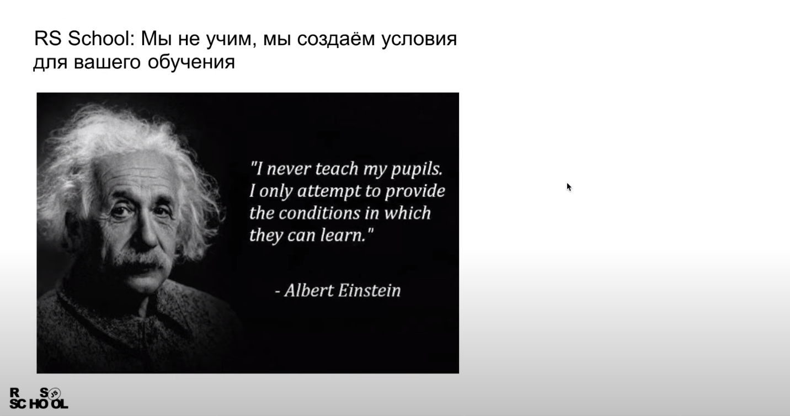

## Описание самостоятельного этапа

**Rolling Scopes School** - бесплатные курсы, проводимые сообществом разработчиков The Rolling Scopes с 2013 года. В RS School может учиться каждый, независимо от возраста, профессии, места жительства. Здесь созданы условия, в которых можно быстро и результативно приобретать необходимые навыки. За полгода интенсивных занятий хорошо успевающие студенты получают достаточно знаний и опыта для смены профессии. 

RS School предоставляет: 
- учебную программу
- среду для общения
- платформу для организации учебного процесса.  

Первый этап обучения – самостоятельный. Студенты получают задания и ссылки на материалы. По результатам выполнения заданий студенты зачисляются в RS School и получают первые баллы в score. 

Продолжительность самостоятельного этапа может составлять 2-8 недель и больше, в зависимости от уровня подготовки, способностей, количества времени, которое можете посвятить учёбе.

## Основные вопросы самостоятельного этапа:
(все ссылки кликабельны)  
1. [Настройка окружения](materials/tools.md)
2. [Работа с Git](materials/git.md)
3. [HTML & CSS](materials/html.md)
4. [Базовый JavaScript](materials/js.md)
5. [Знакомство с документацией курса](materials/rs-school.md)
6. [Рекомендации по изучению английского](materials/ english.md)

## Задания самостоятельного этапа:
(все ссылки кликабельны)
| № | Задание                                                      |    Тема    | Форма проверки | Количество баллов |
| - | ------------------------------------------------------------ | ---------- | -------------- | ----------------- |
| 1 |[Test: HTML & CSS](https://forms.gle/etfLS7wkavJ8tzDZ6)       | HTML & CSS | Test           | 30 х 0.2 = 6      |
| 2 |[Test: Basic JavaScript](https://forms.gle/BZBNd8G9sA4TvtcDA) | JavaScript | Test           | 30 х 0.2 = 6      |
| 3 |[Как учиться в RS School](https://forms.gle/pFhpYzD7nnGuzsJm6)| RS School  | Test           | 30 х 0.2 = 6      |
| 4 |[Codewars](tasks/codewars.md)                                 | JavaScript | Auto-Test      | 15 х 1 = 15       |
| 5 |[Markdown & Git](tasks/git-markdown.md)                       |    Git     | Auto-Test      | 100 х 0.1 = 10    |
| 6 |[HTML, CSS & Git](tasks/html-css-git.md)                      |    Git     | Auto-Test      | 100 х 0.1 = 10    |
| 7 |[HTML & CSS](tasks/html-css.md)                               | HTML & CSS | Cross-Check    | 100 х 0.2 = 20    |
| 8 |[Wildlife](tasks/wildlife.md)                                 | HTML & CSS | Cross-Check    | 50 х 0.5 = 25     |
| 9 |[JavaScript 30](tasks/js30.md)                                | JavaScript | Cross-Check    | 50 х 0.5 = 25     |
|   |                                                              |            | **Всего**      | **123 балла**     |

## Проверка и оценивание результатов

### Тесты выполняемые в Google Forms
- Тесты выполняемые в Google Forms, сабмитить не нужно, достаточно указать в тесте ссылку на свой GitHub-аккаунт, под которым вы зарегистрированы в [rs-app](https://app.rs.school/)
- Проходить тест можно сколько угодно раз, в зачёт идёт лучший результат.
- Результаты тестов переносятся в rs-app в ручном режиме, поэтому отбразятся в score (таблица с результатами) только после того, как их туда импортируют - через несколько дней после дедлайна.

### Тесты выполняемые в rs app
- Тесты выполняемые в rs app, сабмитить не нужно, их проходят уже будучи авторизованными в rs app.
- Проходить тест можно только два раза, в зачёт идёт последний результат. Если в первый раз вы набрали 99 баллов из ста, а во второй - ноль, в score за этот тест пойдёт ноль баллов.
- Результат прохождения теста отобразится сразу, в score он добавится на следующий день после прохождения: таблица с результатами обновляется в четыре утра по Минскому времени.

### Автопроверяемые задания

- Для проверки автопроверяемых заданий созданы автотесты.  
- Автопроверяемые задания необходимо сабмитить в rs app. Для этого до наступления дедлайна зайдите в [rs-app](https://app.rs.school/), выберите **Auto-Test**, в выпадающем списке выберите название задания, добавьте в поле для сабмита указанную информацию, нажмите кнопку **Submit**.  
- Сабмитить автопроверяемые задания можно сколько угодно раз, засчитывается последний результат.  
- Полученные за выполнение задания баллы отобразятся сразу, в score они добавятся на следующий день после прохождения.

### Задания, проверяемые в ходе cross-check

- Cross-Check - взаимопроверка заданий самими студентами. Инструкция по проведению cross-check: https://docs.rs.school/#/cross-check-flow  
- Задания, проверяемые в ходе cross-check, необходимо сабмитить в rs app. Для этого до наступления дедлайна зайдите в [rs-app](https://app.rs.school/), выберите **Cross-Check: Submit**, в выпадающем списке выберите название задания, добавьте в поле для сабмита указанную информацию, нажмите кнопку **Submit**.
- После дедлайна автоматически сгенерируются пары для проверки работ. Каждому студенту нужно будет проверить 4 работы других студентов.
- Для проверки приложения в ходе кросс-чека ссылки на проверяемые работы будут находиться в rs app вкладка **Cross-Check: Review**
- Баллы по результатам cross-check получают только те студенты, которые вовремя засабмитили свою работу и вовремя проверили все присланные на проверку работы других студентов.
- Полученные за выполнение задания баллы будут отобржаться по мере проверки их студентами курса на вкладке **Cross-Check: Submit**, в score они добавятся на следующий день после окончания cross-check.

## Дедлайн

Дедлайн - крайний срок выполнения заданий и подачи их на проверку. После дедлайна выполнить тест или засабмитить таск и получить за него баллы невозможно. Рекомендуется сабмитить задания как можно раньше, как только в rs app появится такая возможность. После сабмита задание можно выполнять до самого дедлайна.