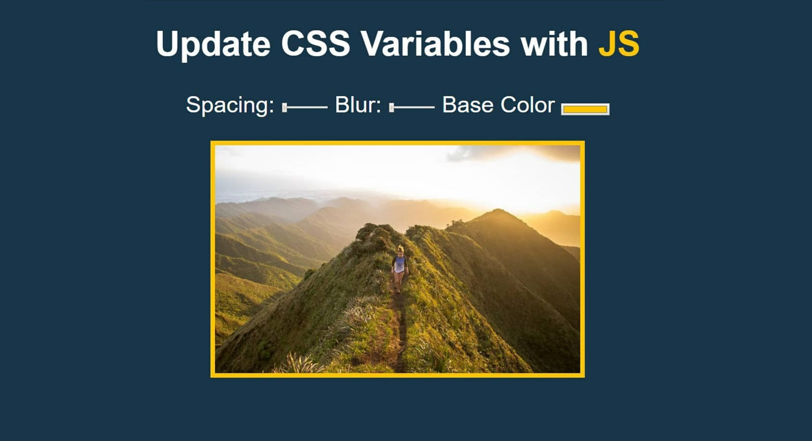

# js30-3

## Day 3: CSS Variables and JS

## Описание проекта
Фоторедактор, позволяющий редактировать изображение, применяя к ним различные свойства и фильтры

## Видео
https://youtu.be/xu87YWbr4X0 (13:13)

## Код
https://github.com/wesbos/JavaScript30/tree/master/03%20-%20CSS%20Variables (9 lines js-code)

## Дополнительный функционал
Добавьте в приложение дополнительные фильтры и возможности редактирования фото, не предусмотренные автором

## Demo
https://js3003.github.io/
