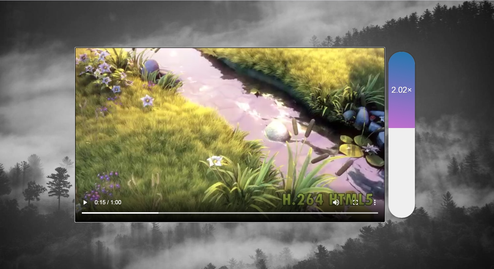

# js30-4
## 4. Day 28: Video Speed Controller

## Описание проекта
Регулятор скорости воспроизведения видео. Перемещая ползунок можно ускорять или замедлять скорость воспроизведение видео

## Видео
https://youtu.be/8gYN_EDMg_M (9:26)

## Код
https://github.com/wesbos/JavaScript30/tree/master/28%20-%20Video%20Speed%20Controller (17 lines js-code)

## Дополнительный функционал
Замените видео на любое другое, измените внешний вид ползунка, регулирующего скорость воспроизведения видео, укажите максимальную скорость воспроизведения видео равную 10х

## Demo
https://js3028.github.io/
