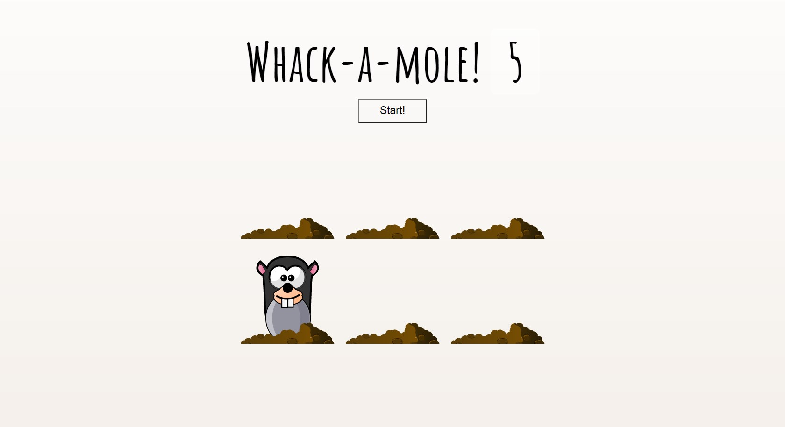

# js30-5

## 5. Day 30: Whack-A-Mole

## Описание проекта
Игра на скорость реакции в которой нужно кликать по целям и зарабатывать баллы

## Видео
https://youtu.be/toNFfAaWghU (14:35)

## Код
https://github.com/wesbos/JavaScript30/tree/master/30%20-%20Whack%20A%20Mole (50 lines js-code)

## Дополнительный функционал
Дополните игру постепенно усложняющимися уровнями, сохранением лучшего результата в LocalStorage и отображение его на странице игры. Количество уровней, в чём должно заключаться усложнение, как может выглядеть переход между уровнями остаётся на ваше усмотрение.

## Demo
https://js3030.github.io/
