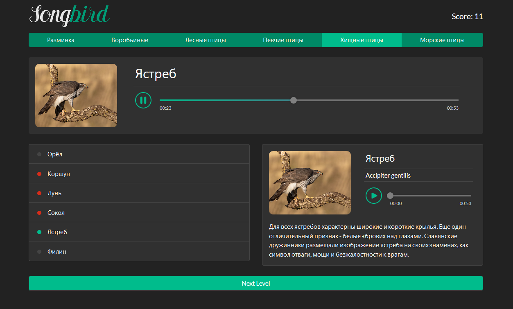

# songbird

Songbird - приложение-викторина для распознавания птиц по их голосам.

## Структура приложения

Приложение состоит из трёх страниц \*:

- стартовая страница приложения
- страница викторины
- страница с результатами

> \* Страницы с точки зрения того, какими их видит пользователь, их техническая реализация остаётся на ваше усмотрение (возможнa реализация с использованием нескольких html файлов и SPA - способ реализации ни как не влияет на оценку)

#### Стартовая страница приложения

1. Стартовая страница определяет общее впечатление о приложении. Приветствуется художественное оформление, анимации, фоновое видео и другие эффекты, привлекающие внимание пользователя
2. В хедере есть логотип приложения, навигация по страницам приложения (стартовая страница и страница викторины)
3. В футере приложения есть ссылка на гитхаб автора, год создания приложения, [логотип курса](https://rs.school/images/rs_school_js.svg) со [ссылкой на курс](https://rs.school/js/)

#### Страница викторины состоит из четырёх блоков:

1. верхняя панель  
   содержит список вопросов и текущий счёт игры
2. блок с текущим вопросом  
   содержит аудиоплеер с записью голоса птицы и заглушки на месте названия и изображения птицы. Когда игрок выбирает правильный ответ, в блоке отображаются название и изображение птицы, голос которой звучал
3. блок с вариантами ответов  
   содержит список с названиями шести разных птиц
4. блок с описанием птицы  
   содержит приглашение послушать плеер и выбрать птицу из списка. Когда игрок выбирает вариант ответа, в блоке отображаются данные о выбранной птице: изображение, русское и латинское название, аудиозапись голоса, краткая информация

#### Страница с результатами

1. Отображается после завершения викторины, содержит набранные в ходе игры баллы
2. Если набрано не максимально возможное количество баллов, игроку предлагается пройти викторину ещё раз. Есть кнопка перенаправляющая к началу игры.
3. Если набрано максимально возможное количество баллов, выводится поздравление и уведомление об окончании игры (этот пункт не проверяется)

#### Demo

https://birds-quiz.netlify.com/  
Демо даёт общее представление о функционале приложения, требованиям задания соответствует только частично

#### Исходные данные

- [RU](https://github.com/rolling-scopes-school/tasks/blob/master/tasks/songbird/birds.js)
- [EN](https://github.com/rolling-scopes-school/tasks/blob/master/tasks/songbird/birds-en.js)

Можно вносить правки или заменить на свои

## Механизм игры

- птица в блоке с вопросом выбирается рандомно
- при клике по варианту ответа с названием птицы, в блоке с описанием птицы выводятся информация о ней
- если игрок выбрал правильный ответ, в блоке с вопросом выводится название и изображение птицы
- в начале игры количество баллов 0. Если игрок дал правильный ответ с первой попытки, его счёт увеличивается на 5 баллов, каждая следующая попытка даёт на один балл меньше, если правильный ответ дан только с последней, шестой попытки, игрок получает за него 0 баллов. Баллы за все вопросы суммируются
- для правильных и неправильных ответов игрока используется звуковая и цветовая индикация
- когда игрок дал правильный ответ, активируется кнопка "Дальше" и он получает возможность перейти к следующему вопросу
- после последнего вопроса выводится страница с результатами игры

## Требования к репозиторию

- задание выполняется в **приватном репозитории школы** [Как работать с приватным репозиторием](https://docs.rs.school/#/private-repository?id=Как-работать-с-приватным-репозиторием)
- в приватном репозитории школы от ветки `main` создайте ветку с названием задания, в ней создайте папку с названием задания, в папке разместите файлы проекта
- для деплоя используйте gh-pages [Как сделать деплой задания из приватного репозитория школы](https://docs.rs.school/#/private-repository?id=Как-сделать-деплой-задания-из-приватного-репозитория-школы)
- при невозможности использовать gh-pages, для деплоя можно использовать https://app.netlify.com/drop. Название страницы дайте по схеме: имя гитхаб аккаунта - название таска
- история коммитов должна отображать процесс разработки приложения. [Требования к коммитам](https://docs.rs.school/#/git-convention?id=Требования-к-именам-коммитов)
- после окончания разработки необходимо сделать Pull Request из ветки приложения в ветку `main` [Требования к Pull Request](https://docs.rs.school/#/pull-request-review-process?id=Требования-к-pull-request-pr). **Мержить Pull Request из ветки разработки в ветку `main` не нужно**

## Технические требования

- работа приложения проверяется в браузере Google Chrome последней версии
- можно использовать css препроцессоры
- запрещено использовать любые js-библиотеки и фреймворки в т.ч. jQuery
- запрещено использовать TypeScript

## Рекомендации по написанию кода

- правильное именование переменных и функций
- используйте prettier для форматирования кода, отформатированный код проще читается
- избегайте дублирования кода, повторяющиеся фрагменты кода вынесите в функции
- стремитесь к оптимальному размеру функций, следуйте правилу: одна функция – одна задача
- избегайте глубокой вложенности циклов, магических чисел
- используйте делегирование
- используйте фичи ES6 и выше, например, let, const для объявления переменных, стрелочные функции и т.д
- разбейте js-код на модули
- используйте async/await функции для работы с асинхронным кодом
- для сборки приложения используйте Webpack.

## Требования к вёрстке и оформлению приложения

- при вёрстке и оформлении приложения ориентируйтесь на демо, на примеры дизайна на [dribbble](https://dribbble.com/tags/bird_app_ui) и [behance](https://www.behance.net/search/projects/?search=birds%20app)
- вёрстка адаптивная. Корректность отображения приложения проверяется на ширине от 1920рх до 360рх
- интерактивность элементов, с которыми пользователи могут взаимодействовать, изменение внешнего вида самого элемента и состояния курсора при наведении, использование разных стилей для активного и неактивного состояния элемента
- обязательное требование к интерактивности: плавное изменение внешнего вида элемента при наведении и клике не влияющее на соседние элементы
- читабельность текста: минимальный размер шрифта на любом разрешении экрана не меньше 14рх, достаточная контрастность цвета фона и цвета шрифта. Проверить контрастность на соответствие стандартам можно [здесь](https://webaim.org/resources/contrastchecker/).

## Как сабмитить задание

Засабмитить задание необходимо как можно раньше, как только в rs app появится такая возможность. Для этого зайдите в rs app https://app.rs.school/, выберите пункт Cross-Check: Submit, в выпадающем списке выберите название таска, в поле Solution URL добавьте ссылку на задеплоенную версию вашего приложения, нажмите кнопку Submit.  
После сабмита задания его можно продолжать выполнять до самого дедлайна.

## Критерии оценки при cross-check:

**Максимальный балл за задание: 270 баллов**

- **Вёрстка, дизайн, UI всех трёх страниц приложения +60**
  - Стартовая страница приложения (вёрстка адаптивная - проверяется на ширине от 1920рх до 360рх) +20
  - Страница викторины (вёрстка адаптивная - проверяется на ширине от 1920рх до 360рх) +30
  - Страница с результатами (вёрстка адаптивная - проверяется на ширине от 1920рх до 360рх) +10
- **Аудиоплеер +30**  
  (можно выбрать только один из трёх пунктов)

  - стандартный HTML5 +10
  - кастомный, функционал полностью такой же, как в [демо](https://birds-quiz.netlify.com/) приложения, могут быть небольшие отличия в оформлении, например, может отличаться по цвету: +20
  - у кастомного аудиоплеера из предыдущего пункта есть регулятор громкости звука +30

- **Верхняя панель страницы викторины +20**
  - правильное отображение счета игры +10
  - текущий вопрос выделяется стилем +10
- **Блок с вопросом +20**

  - подстановка дефолтного изображения и замена названия птицы на символы (\*\*\*), пока игрок не выберет правильный ответ +10
  - при выборе правильного ответа в блоке с вопросом отображается изображение и название загаданной птицы +10

- **Блок с вариантами ответов (названия птиц) +60**

  - цветовая индикация правильного/неправильного ответа в виде индикаторов разного цвета рядом с названием птицы: +10
  - звуковая индикация правильного/неправильного ответа: +30
    - при выборе правильного или неправильного ответа издаются разные звуковые сигналы: +10
    - при выборе неправильного ответа проигрывание аудиоплеера не должно останавливаться: +10
    - при выборе правильно ответа проигрывание аудиоплеера должно остановиться: +10
  - при клике по названию птицы в блоке с описанием птицы отображается информацию о ней: +10
  - если правильный ответ уже дан, возможность просматривать описания птиц при клике по вариантам ответов остаётся, цвет индикаторов при этом не изменяется: +10

- **Блок с описанием птицы: +30**
  - пока игрок не кликнул по названию птицы из списка, в блоке выводится короткий текст с предложением послушать плеер и выбрать название птицы, чей голос прозвучал +10
  - при клике по названию птицы из списка, в блоке с описанием птицы появляется актуальная информация о ней +20  
    Информация о птице включает:
    - изображение
    - название (на русском и на латыни)
    - аудиоплеер с записью голоса
    - дополнительное описание птицы.
- **Кнопка перехода к следующему вопросу +30**
  - пока не выбран правильный ответ, кнопка не активна, нет возможности перейти к следующему заданию. Активное и неактивное состояние кнопки визуально отличаются, например, активная кнопка имеет зеленый, не активная - серый цвет +10
  - после правильного ответа на последний вопрос игрок переходит к странице с результатами викторины +10
  - страница с результатами содержит количество набранных баллов и кнопку с предложением сыграть ещё раз (или уведомление об окончании игры, если набрано максимальное количество баллов) +10
- **Extra scope +20**  
  Можно выбрать предложенные варианты или придумать свои, аналогичные им по сложности
  - локализация приложения на два языка, выбранный язык хранится в local storage и сохраняется при перезагрузке +10
  - создание галереи всех птиц приложения c информацией о них (фото, аудио, название, описание) +10

## Штрафные баллы

- Использование любыx js-библиотек и фреймворков в т.ч. jQuery **-100500**
- Использование TypeScript **-100500**

#### Возможность изменения темы приложения

Вместо викторины с голосами птиц вы можете придумать и создать приложение на другую тематику - викторина по музыкальным произведениям, авторам, жанрам, фильмам, звуковым заставкам из компьютерных игр и т д. При этом в созданном приложении необходимо реализовать все перечисленные в задании требования и критерии. Количество раундов игры и вариантов ответа, должны быть не меньше чем в примере с "Голосами птиц".

### Cross-check

- инструкция по проведению cross-check: https://docs.rs.school/#/cross-check-flow
- для удобства проверки самооценку своей работы выведите в консоль (функция console.log)
