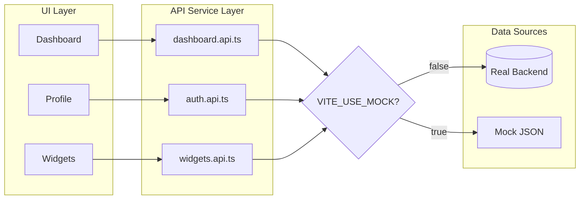

# Tandem: Data Architecture & Backend Strategy

В Tandem любая значимая фича затрагивает три слоя: **UI** (интерфейс), **API** (транспорт) и **DB** (хранение). Попытка реализовать все слои одновременно (end-to-end) с первого дня несет сложности:

* Сложность отладки (неясно, где ошибка: в верстке или в данных).
* Блокировка фронтенда (ждем готовности эндпоинта).
* Высокая цена ошибки (изменение структуры БД требует переписывания UI).

Поэтому мы предлагаем использовать паттерг API Service Layer (частный случай паттерна Repository).
Который позволяет обеспечить:

* **Параллельную разработку:** UI-команда не блокируется отсутствием бэкенда.
* **Изоляцию слоев:** UI-компоненты не зависят от деталей реализации API.
* **Качественный UX:** Тестирование состояний загрузки (loaders/skeletons) с первого дня.
* **Предсказуемую интеграцию:** Подключение реального бэкенда происходит без рефакторинга компонентов.

---

## 1. Repository Pattern (Теория)

### Что это?

**Repository** — это паттерн проектирования, который **изолирует логику доступа к данным** от бизнес-логики приложения.

Вместо того чтобы UI-компонент знал *как* получить данные (fetch, SQL, localStorage), он просто *просит* их у Repository.

```
┌─────────────────────────────────────────────────────────┐
│                      UI / Business Logic                │
│   "Мне нужен список пользователей"                      │
└───────────────────────────┬─────────────────────────────┘
                            │
                            ▼
┌─────────────────────────────────────────────────────────┐
│                       Repository                        │
│   "Я знаю, откуда их взять"                             │
└───────────────────────────┬─────────────────────────────┘
                            │
            ┌───────────────┼───────────────┐
            ▼               ▼               ▼
        ┌───────┐      ┌───────┐      ┌───────┐
        │  API  │      │  DB   │      │ Cache │
        └───────┘      └───────┘      └───────┘
```

### Зачем это нужно?

1. **Изоляция:** UI не знает про `fetch`, `SQL`, `Supabase`. Он просто вызывает `getUsers()`.
2. **Тестируемость:** Легко подменить реальный источник на мок.
3. **Гибкость:** Сменить базу данных? Поменяйте только Repository, UI не трогаем.

### Пример (псевдокод)

```typescript
// ❌ БЕЗ Repository — UI знает про детали реализации
class Dashboard {
  async render() {
    const response = await fetch('https://api.example.com/users');
    const users = await response.json();
    // render...
  }
}

// ✅ С Repository — UI просто просит данные
class Dashboard {
  constructor(private userRepo: UserRepository) {}
  
  async render() {
    const users = await this.userRepo.getAll();
    // render...
  }
}
```

---

## 2. API Service Layer (Наша реализация)

### Что это?

**API Service Layer** — это конкретная реализация Repository Pattern для фронтенд-приложений.

Вместо абстрактного "Repository" мы создаём **файлы-сервисы** в папке `src/api/`, где каждый файл отвечает за свою "область" данных:

```
src/
├── api/
│   ├── auth.api.ts        # login, logout, register
│   ├── dashboard.api.ts   # getStats, getHistory
│   ├── widgets.api.ts     # getWidgetById, validateAnswer
│   └── ai.api.ts          # sendMessage, startSession
```

Компоненты UI никогда не делают прямых запросов (`fetch`) и не знают, откуда приходят данные. Они обращаются к сервису, который возвращает `Promise<T>`.

### Главная фишка: Mock Mode

Каждый API-сервис умеет работать в двух режимах:
- **Mock Mode:** Возвращает тестовые данные (бэкенд не нужен)
- **Real Mode:** Делает реальные запросы к серверу/БД

Переключение — одной переменной в `.env`:

```bash
VITE_USE_MOCK=true   # Mock Mode (для разработки)
VITE_USE_MOCK=false  # Real Mode (для продакшена)
```

### Диаграмма



**UI не знает**, откуда данные — из реального сервера или из заглушки. Это знает только API Layer.

---

## 3. Реализация: Базовый пример

### Структура API-сервиса

Каждый файл в `src/api/` следует одному шаблону:

```typescript
// src/api/dashboard.api.ts

import { UserStats } from '@/types';

// 1. Флаг режима
const USE_MOCK = import.meta.env.VITE_USE_MOCK === 'true';

// 2. Мок-данные
const MOCK_STATS: UserStats = {
  xp: 1250,
  streak: 5,
  completedTasks: 42,
  rank: 'Middle'
};

// 3. Публичная функция
export const getDashboardStats = async (): Promise<UserStats> => {
  if (USE_MOCK) {
    return MOCK_STATS;
  }
  
  // Real implementation
  const response = await fetch('/api/dashboard/stats');
  return response.json();
};
```

### Что тут происходит?

| Часть | Зачем |
|-------|-------|
| `USE_MOCK` | Читает флаг из `.env`, определяет режим |
| `MOCK_STATS` | Тестовые данные для разработки |
| `getDashboardStats()` | Единственное что видит UI |

---

## 4. Детали реализации

### 4.1 Реалистичные мок-данные

**❌ Плохо:**
```typescript
const MOCK_USER = { name: 'test' };
```

**✅ Хорошо:**
```typescript
const MOCK_USER: User = {
  id: 'usr_a1b2c3d4',
  email: 'john.doe@example.com',
  name: 'John Doe',
  avatarUrl: 'https://i.pravatar.cc/150?u=john',
  createdAt: '2025-01-15T10:30:00Z'
};
```

**Почему это важно:**
- TypeScript проверит, что мок соответствует интерфейсу
- UI будет выглядеть реалистично при разработке
- Легче заметить проблемы с layout (длинные имена, отсутствие аватара и т.д.)

---

### 4.2 Эмуляция задержки сети

Реальные запросы занимают время. Если моки возвращаются мгновенно, вы не увидите:
- Скелетоны (skeleton loaders)
- Спиннеры
- Состояния загрузки

**Решение:** Добавьте искусственную задержку в моки:

```typescript
export const getDashboardStats = async (): Promise<UserStats> => {
  if (USE_MOCK) {
    // Эмулируем сетевую задержку (300-800ms)
    await new Promise(r => setTimeout(r, 500));
    return MOCK_STATS;
  }
  // ...
};
```

**Совет:** Можно сделать задержку случайной для реалистичности:

```typescript
const delay = (ms: number) => new Promise(r => setTimeout(r, ms));
const randomDelay = () => delay(300 + Math.random() * 500); // 300-800ms
```

---

### 4.3 Маппинг данных (Adapter Pattern)

Часто данные из БД приходят в формате, отличном от того, что нужен UI:

```typescript
// Из базы данных (snake_case)
{
  "total_xp": 1250,
  "days_streak": 5,
  "tasks_done": 42
}

// Нужно в UI (camelCase)
{
  "xp": 1250,
  "streak": 5,
  "completedTasks": 42
}
```

**Решение:** Маппинг внутри API-сервиса:

```typescript
export const getDashboardStats = async (): Promise<UserStats> => {
  if (USE_MOCK) return MOCK_STATS;
  
  const response = await fetch('/api/dashboard/stats');
  const raw = await response.json();
  
  // Адаптируем "грязные" данные к чистому интерфейсу
  return {
    xp: raw.total_xp,
    streak: raw.days_streak,
    completedTasks: raw.tasks_done,
    rank: raw.current_rank
  };
};
```

**Зачем:** UI работает с чистыми, предсказуемыми данными. Детали БД скрыты в API Layer.

---

### 4.4 Обработка ошибок

Моки обычно не падают. Реальные запросы — падают. Добавьте обработку:

```typescript
export const getDashboardStats = async (): Promise<UserStats> => {
  if (USE_MOCK) {
    await delay(500);
    return MOCK_STATS;
  }
  
  const response = await fetch('/api/dashboard/stats');
  
  if (!response.ok) {
    throw new Error(`HTTP ${response.status}: ${response.statusText}`);
  }
  
  const raw = await response.json();
  return mapToUserStats(raw);
};
```

**В UI:**
```typescript
try {
  const stats = await getDashboardStats();
  renderStats(stats);
} catch (error) {
  showErrorMessage(error.message);
}
```

---

## 5. Итог: Полный пример

```typescript
// src/api/dashboard.api.ts

import { UserStats } from '@/types';

const USE_MOCK = import.meta.env.VITE_USE_MOCK === 'true';

// === MOCK DATA ===
const MOCK_STATS: UserStats = {
  xp: 1250,
  streak: 5,
  completedTasks: 42,
  rank: 'Middle'
};

// === HELPERS ===
const delay = (ms: number) => new Promise(r => setTimeout(r, ms));

const mapToUserStats = (raw: any): UserStats => ({
  xp: raw.total_xp,
  streak: raw.days_streak,
  completedTasks: raw.tasks_done,
  rank: raw.current_rank
});

// === PUBLIC API ===
export const getDashboardStats = async (): Promise<UserStats> => {
  // Mock Mode
  if (USE_MOCK) {
    console.log('⚠️ [MOCK] getDashboardStats');
    await delay(500);
    return MOCK_STATS;
  }
  
  // Real Mode
  const response = await fetch('/api/dashboard/stats');
  
  if (!response.ok) {
    throw new Error(`Failed to fetch stats: ${response.status}`);
  }
  
  const raw = await response.json();
  return mapToUserStats(raw);
};
```

---

## Резюме

| Концепция | Что делает | Зачем |
|-----------|------------|-------|
| **Repository Pattern** | Изолирует доступ к данным | Теоретическая основа |
| **API Service Layer** | Папка `src/api/` с файлами-сервисами | Практическая реализация |
| **Mock Mode** | Переключатель `VITE_USE_MOCK` | Параллельная работа |
| **Реалистичные моки** | Полные данные, соответствующие типам | Качество UI при разработке |
| **Задержка сети** | `await delay(500)` | Проверка лоадеров |
| **Маппинг** | Преобразование данных | Изоляция от формата БД |
| **Обработка ошибок** | `try/catch` | Стабильность |

---


# 6. Стратегия выбора Backend-стека

Выбор технологии бэкенда остается за командой и не влияет на оценку проекта, при условии соблюдения архитектурных правил.

### Option A: BaaS (Backend-as-a-Service) — Рекомендуется

*Стек: Supabase, Firebase, Appwrite.*

Подходит, если команда хочет сфокусироваться на сложном фронтенде и быстрее собрать MVP.

* ✅ **Плюсы:** Готовая авторизация, база данных и API "из коробки", минимум DevOps.
* ⚠️ **Минусы:** Меньше гибкости в кастомной логике.

### Option B: Custom Backend

*Стек: Node.js + Express / NestJS + PostgreSQL / Mongo.*

Подходит, если цель — прокачать навыки бэкенд-разработки и получить полный контроль над логикой.

* ✅ **Плюсы:** Полный контроль над API, возможность реализации сложных сценариев (валидация, стриминг, веб-сокеты).
* ⚠️ **Минусы:** Требует больше времени на настройку инфраструктуры.