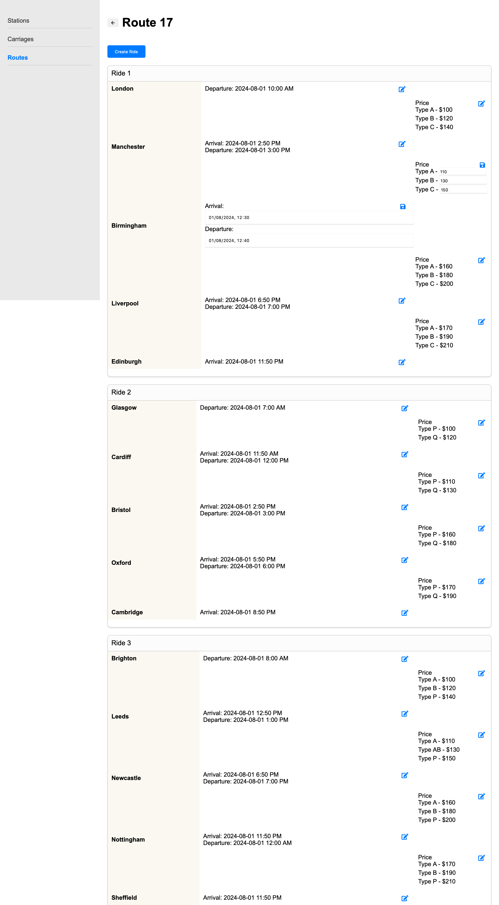

# Schedule

**Browser path:** _/admin/routes/{id}_

**Score**: 100

**Access**: only for manager (run by guards)

## Description

After creating the general route, the manager must set up the train schedule and specify the fare.

To allow users to travel any number of stations and pay only for that portion of the journey rather than the entire route, the manager needs to specify the price for each segment between stations and for each type of carriage present on the train.

Travel time is indicated for each station as _arrival time_ (except for the first one) and _departure time_ (except for the last one).

**Segment** is a part of the route between stations that has its own fare for each type of carriage.

### Requirements

#### Requirement 1: Navigation

- The page must include a "Back" button that navigates the manager back to the route page.

#### Requirement 2: Page title

- The page title must include the route index.

#### Requirement 3: List of rides

- The page must display a list of ride cards, each with:
  - Ride id in the title.
  - A list of stations, arrival/departure time and prices.

#### Requirement 4: Editing times

- Each cell for arrival/departure times must have an "Edit" button.
- Clicking the "Edit" button must allow the manager to edit the time and save the changes.

#### Requirement 5: Editing prices

- Each cell for prices must have an "Edit" button.
- Clicking the "Edit" button must allow the manager to edit the prices and save the changes.

#### Requirement 6: Creating new rides

- The page must include a "Create" button.
- Clicking the "Create" button must create a new ride list with:
  - Predefined stations vertically.
  - Form fields for entering departure/arrival times.
  - Form fields for entering prices.

### Acceptance Criteria (100)

#### Acceptance Criteria 1: Navigation (5)

- When the "Back" button is clicked, the manager must be navigated back to the route page.

#### Acceptance Criteria 2: Page title (5)

- The page title must include the route id, displaying it clearly at the top.

#### Acceptance Criteria 3: List of rides (30)

- Each ride card in the list must display:
  - The ride id in the title.
  - A vertical list of stations as the first column.
  - The arrival time (except for the first station) and departure time (except for the last station) for each station as the second column.
  - Prices for all carriage types in the middle of the previous and next station rows.

#### Acceptance Criteria 4: Editing times (20)

- Each cell for arrival/departure time must include an "Edit" button.
- When the "Edit" button is clicked, the cell must become editable.
- The manager must be able to edit the time and save the changes.
- After saving, the updated time must be displayed in the cell.

#### Acceptance Criteria 5: Editing prices (20)

- Each cell for prices must include an "Edit" button.
- When the "Edit" button is clicked, the cell must become editable.
- The manager must be able to edit the prices for each carriage type and save the changes.
- After saving, the updated prices must be displayed in the cell.

#### Acceptance Criteria 6: Creating new rides (10)

- When the "Create" button is clicked, a new ride list must be created with:
  - Predefined stations listed as the first column.
  - Form fields for entering departure and arrival times as the second column.
  - Form fields for entering prices as the third column.

#### Acceptance Criteria 7: Deleting a ride (10)

- Rides departing from the first station in the future contain a "Delete" button
- When the "Delete" button is clicked:
  - A confirmation modal must appear.
  - Upon confirming the deletion, the ride must be removed from the list.

## API

### Retrieve route information

> `(GET) /api/route/{id}`

- Request (application/json)
- Parameters:
  - id: `17` (number, required) - Identifier of the route

- Response 200 (application/json)
  - Attributes: (array[object])
    - id: `64` (number) - Route identifier
    - path: `[33, 5, 62, 11, 48, 34]` (array[number]) - List of station identifiers
    - carriages: `['carriage_type_2', 'carriage_type_2', 'carriage_type_2', 'carriage_type_2', 'carriage_type_7', 'carriage_type_7', 'carriage_type_7', 'carriage_type_7']` (array[string]) - List of carriage types for the train
    - schedule: (array[object]) - List of potential rides
      - rideId: `44` (number) - Identifier of certain schedule for the route
      - segments: (array[object]) - List of road section between each station. Always 1 less than the number of stations on the route
        - time: `['2024-08-08T22:19:57.708Z', '2024-08-12T03:29:57.708Z']` ([string, string]) - dates of the start of movement on the section and the end of movement on the section in string form - [departure_from_prev_station, arrival_at_next_station]
        - price: (object) - set of prices for all carriage types on this route. It has vary size depending on the train configuration
          - dynamic_carriage_type_1: `210` (number) - the price of 210 units for _dynamic_carriage_type_1_ carriage type on current section

### Create new ride

> `(POST) /api/route/{routeId}/ride`

- Request (application/json)
  - Parameters:
    - routeId: `17` (number, required) - Identifier of the route
  - Body (object)
    - segments: (array[object])
      - time: `['2024-08-08T22:19:57.708Z', '2024-08-12T03:29:57.708Z']` ([string, string]) - dates of the start of movement on the section and the end of movement on the section in string form - [departure_from_prev_station, arrival_at_next_station]
      - price: (object) - set of prices for all carriage types on this route. It has vary size depending on the train configuration
        - dynamic_carriage_type_1: `210` (number) - the price of 210 units for _dynamic_carriage_type_1_ carriage type on current section

- Response 201 (application/json)
  - Attributes (object)
    - id: `215` (number) - New ride identifier

- Response 401 (application/json)
  - Attributes (object)
    - error:
      - message: `Access is not granted` (string) - Error message
      - reason: `invalidAccessToken` (string) - Wrong token idintifier

- Response 400 (application/json)
  - Attributes (object)
    - error:
      - message: `Route not found` (string) - Error message if routeId is wrong
      - reason: `recordNotFound` (string) - Wrong token idintifier

### Update ride

> `(PUT) /api/route/{routeId}/ride/{rideId}`

- Request (application/json)
  - Parameters:
    - routeId: `17` (number, required) - Identifier of the route
    - rideId: `215` (number, required) - Identifier of the ride
  - Body (object)
    - segments: (array[object])
      - time: `['2024-08-08T22:19:57.708Z', '2024-08-12T03:29:57.708Z']` ([string, string]) - dates of the start of movement on the section and the end of movement on the section in string form - [departure_from_prev_station, arrival_at_next_station]
      - price: (object) - set of prices for all carriage types on this route. It has vary size depending on the train configuration
        - dynamic_carriage_type_1: `210` (number) - the price of 210 units for _dynamic_carriage_type_1_ carriage type on current section

- Response 200 (application/json)
  - Attributes (object)

- Response 401 (application/json)
  - Attributes (object)
    - error:
      - message: `Access is not granted` (string) - Error message
      - reason: `invalidAccessToken` (string) - Wrong token idintifier

- Response 400 (application/json)
  - Attributes (object)
    - error:
      - message: `Ride not found` (string) - Error message if routeId or rideId is wrong
      - reason: `recordNotFound` (string) - Wrong token idintifier

## Design example

> [!WARNING]
> All mockups should not be considered as final versions! We are providing an idea; you can come up with any design as long as it meets the functional requirements.

### Ride list with edit field

