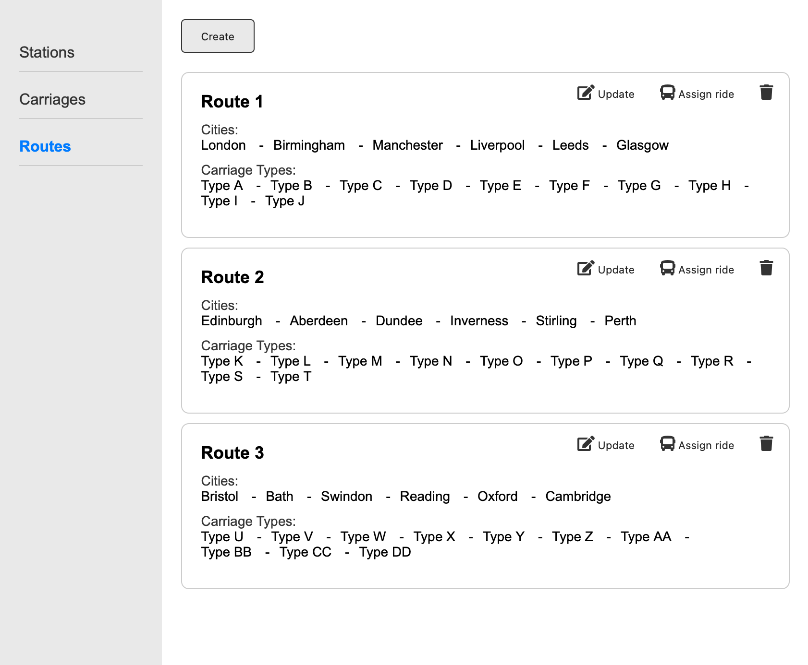
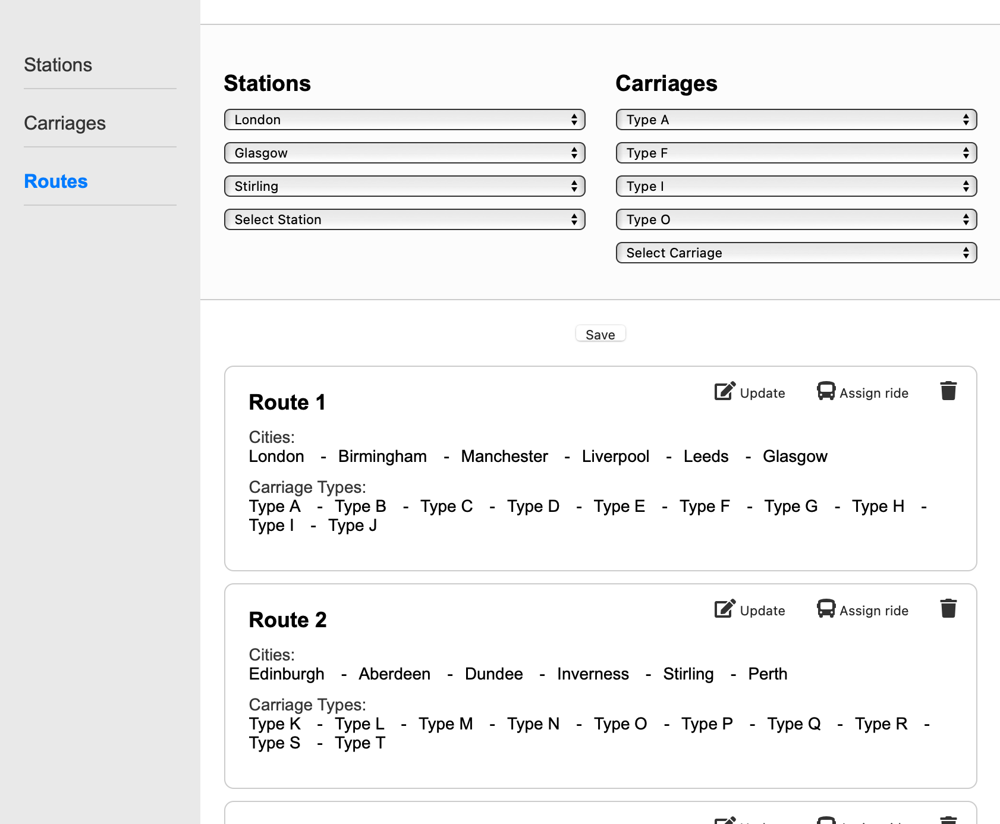

# Routes (manager)

**Browser path:** _/admin/routes_

**Score**: 100

**Access**: only for manager (run by guards)

## Description

The page allows the manager to combine stations and types of carriages, creating a unique train route between cities with a set of carriages of different types, quantities, and sequences.

A route is just a map of the train's movement; it does not include prices or travel times.

Minimum 3 carriages, minimum 3 stations;

### Requirements

#### Requirement 1: Display of routes

- The page must display a list of routes, each with the detail information.

#### Requirement 2: Route management actions

- Each route card must have the following action buttons: "Delete", "assign Ride", "Update".

#### Requirement 3: Deleting a route

- The "Delete" button must open a confirmation modal.
- Upon confirmation, the route must be deleted from the list.

#### Requirement 4: Assigning a ride

- The "Assign Ride" button must open a [page](./ride.md) where the manager can create a new schedule for the route.

#### Requirement 5: Creating and updating routes

- A "Create" button must be present at the top of the page.
- Clicking the "Create" or "Update" button must display a form with two sections:
  - Left Section with stations
  - Right Section with carriages
- The form must include a "Save" button to save the new or updated route.

#### Requirement 6: Saving routes

- Clicking the "Save" button must save the new route or update the existing route.
- The new route must appear in the list of routes, or the updated route must replace the existing route.

### Acceptance Criteria (100)

#### Acceptance Criteria 1: Display of routes (10)

- The page must list all routes with the following information:
  - Route name.
  - Sequence of cities the route passes through.
  - Sequence of carriage types assigned to the route.

#### Acceptance Criteria 2: Route management actions (15)

- Each route card must include:
  - A "Delete" button that opens a confirmation modal.
  - An "Assign Ride" button that navigates to a new page for schedule creation.
  - An "Update" button that displays the form for updating the route.

#### Acceptance Criteria 3: Deleting a route (10)

- When the "Delete" button is clicked:
  - A confirmation modal must appear.
  - Upon confirming the deletion, the route must be removed from the list.

#### Acceptance Criteria 4: Assigning a ride (10)

- When the "Assign Ride" button is clicked:
  - The manager must be navigated to a [page](./ride.md) where they can observe existing rides or create a new schedule for the route.

#### Acceptance Criteria 5: Creating and updating routes (45)

- When the "Create" button is clicked:
  - A form must appear at the top of the page with two sections for adding stations and carriages.
- When the "Update" button on a route card is clicked:
  - The same form must appear pre-filled with the existing route details.
- The form must allow:
  - Adding any number of stations in sequence, with a new empty selector appearing when the last one is filled.
  - **In the list of selectable stations, there should be only those stations that are explicitly connected to the previous one in the list, i.e., stations from the 'connectedTo' list.**
  - Adding any number of carriage types in sequence, with a new empty selector appearing when the last one is filled.

#### Acceptance Criteria 6: Saving routes (10)

- When the "Save" button is clicked:
  - The new route must be added to the list of routes if creating a new route.
  - The updated route must replace the existing route in the list if updating a route.

## API

### To retrieve routes

> `(GET) /api/route`

- Request (application/json)
  - Attributes: (object)

- Response 200 (application/json)
  - Attributes: (array[object])
    - id: `64` (number) - Route identifier
    - path: `[33, 5, 62, 11, 48, 34]` (array[number]) - List of station identifiers
    - carriages: `['carriage_type_2', 'carriage_type_2', 'carriage_type_2', 'carriage_type_2', 'carriage_type_7', 'carriage_type_7', 'carriage_type_7', 'carriage_type_7']` (array[string]) - List of carriage types for the train

### To create new route

> `(POST) /api/route`

- Request (application/json)
  - Body (object)
    - path: `[33, 5, 62, 11, 48, 34]` (array[number]) - List of station identifiers
    - carriages: `['carriage_type_2', 'carriage_type_2', 'carriage_type_2', 'carriage_type_2', 'carriage_type_7', 'carriage_type_7', 'carriage_type_7', 'carriage_type_7']` (array[string]) - List of carriage identifiers for the train

- Response 201 (application/json)
  - Attributes (object)
    - id: `17` (number) - New route identifier

- Response 401 (application/json)
  - Attributes (object)
    - error:
      - message: `Access is not granted` (string) - Error message
      - reason: `invalidAccessToken` (string) - Wrong token idintifier

### To update route

> `(PUT) /api/route/{id}`

- Request (application/json)
  - Parameters:
    - id: `17` (number, required) - Identifier of the route
  - Body (object)
    - path: `[33, 5, 62, 11, 48, 34]` (array[number]) - List of station identifiers
    - carriages: `['carriage_type_2', 'carriage_type_2', 'carriage_type_2', 'carriage_type_2', 'carriage_type_7', 'carriage_type_7', 'carriage_type_7', 'carriage_type_7']` (array[string]) - List of carriage identifiers for the train

- Response 200 (application/json)
  - Attributes (object)
    - id: `17` (number) - Route identifier

- Response 401 (application/json)
  - Attributes (object)
    - error:
      - message: `Access is not granted` (string) - Error message
      - reason: `invalidAccessToken` (string) - Wrong token idintifier

### Delete route

> `(DELETE) /api/route/{id}`

- Request (application/json)
  - Parameters:
    - id: `17` (number, required) - Identifier of the route

- Response 200 (application/json)
  - Attributes: (object)

- Response 401 (application/json)
  - Attributes (object)
    - error:
      - message: `Access is not granted` (string) - Error message
      - reason: `invalidAccessToken` (string) - Wrong token idintifier

- Response 400 (application/json)
  - Attributes (object)
    - error:
      - message: `Route not found` (string) - Error message if routeId is wrong
      - reason: `recordNotFound` (string) - Unique error type

- Response 400 (application/json)
  - Attributes (object)
    - error:
      - message: `Route is already used` (string) - Error message if some order exist with certain route
      - reason: `recordInUse` (string) - Unique error type

## Design example

> [!WARNING]
> All mockups should not be considered as final versions! We are providing an idea; you can come up with any design as long as it meets the functional requirements.

### Route list

### Create new route

## Next section

- [Assign ride](./ride.md)
