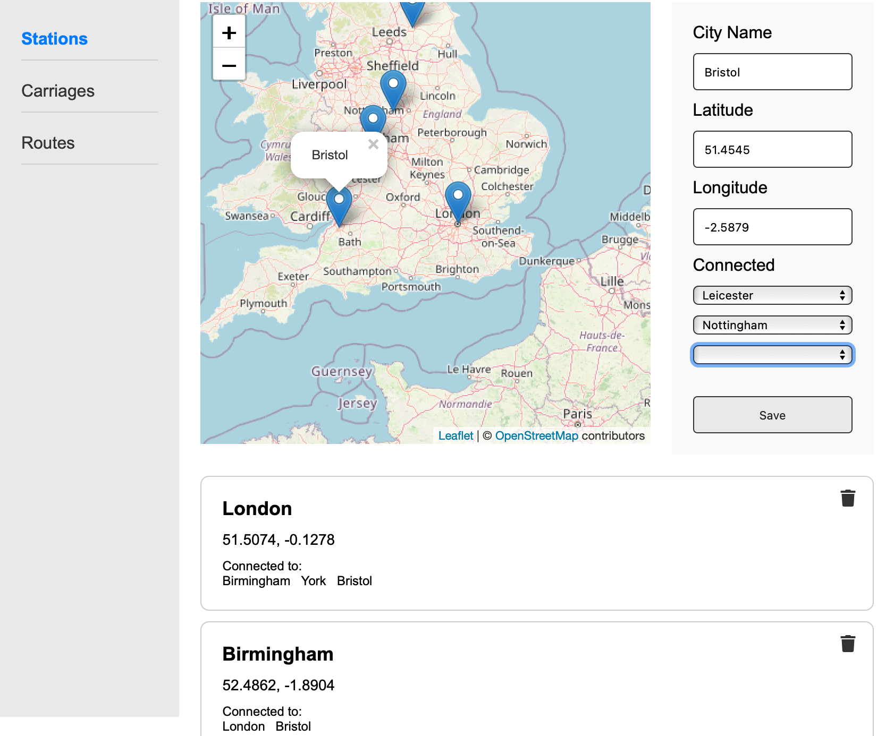

# Stations (manager)

**Browser path:** _/admin/stations_

**Score**: 50

**Access**: only for manager (run by guards)

## Description

A train station is a place where trains stop for passengers to get on and off. They are connected by railway tracks, which allow trains to travel only between them.

> [!IMPORTANT]
> Application constraints: maximum 1 station can be in one city.

Each station must be marked with geographical coordinates. Technically, this can be done in various ways: by searching with autocomplete for cities, by searching for a point on a map, or even by combining both methods.

It does not matter what the way is chosen, latitude/longitude have to be assigned to the station instance.

### Requirements

#### Requirement 1: Station coordinates input

- The page must provide any methods for inputting station coordinates (latitude and longitude):
  - Form fields where the manager can manually enter latitude and longitude values.
  - An interactive map where the manager can drop a point to set the station's coordinates.

#### Requirement 2: Connecting stations

- The page must allow the manager to connect the new station to a list of existing stations, enabling the train to move between them.
- The approach for connecting stations can be implemented in one of the following ways:
  - Using the map to visually connect stations.
  - Using form fields where the manager can select stations from a list and establish connections.

#### Requirement 3: Displaying existing stations

- Below the station creation section, the page must display a list of existing stations.

#### Requirement 4: Deleting Stations

- The page must allow the manager to delete an existing station, but only if there are no active rides passing through that station.
- If an attempt is made to delete a station with active rides, an appropriate error message must be displayed.

### Acceptance Criteria (50)

#### Acceptance Criteria 1: Station coordinates input (20)

- The page must provide form fields for latitude and longitude.
- When valid latitude and longitude values are entered, they must be accepted and saved.
- The page could also provide an interactive map.
- When a point is dropped on the map, the corresponding latitude and longitude values must be populated and synchronized with form field.

#### Acceptance Criteria 2: Connecting stations (15)

- The page must allow the manager to connect the new station to other stations. It is dynamic number of items, selecting one item the next form field appears.
- If using a map, the manager must be able to draw connections between stations.
- If using form fields, the manager must be able to select and connect stations from a list.
- Name, coordinates and connection list are required. The connections must be saved and displayed correctly.

#### Acceptance Criteria 3: Displaying existing stations (10)

- The page must display a list of existing stations below the station creation section.
- Each station entry in the list must display:
  - The station name.
  - The coordinates (latitude and longitude).
  - A list of other stations it is connected with.

#### Acceptance Criteria 4: Deleting stations (5)

- The page must allow the deletion of a station only if there are no active rides passing through it.
- If an attempt is made to delete a station with active rides, an error message "Cannot delete station with active rides" must be displayed.
- If there are no active rides, the station must be successfully deleted from the list.

## API

### Retrieve station list

> `(GET) /api/station`

- Response 200 (application/json)
  - Attributes (array[object])
    - id: `5` (number) - Station identifier
    - city: `London` (string) - City name where station is located
    - latitude: `51.5074` (number) - Latitude of the station
    - longitude: `-0.1278` - Longitude of the station
    - connectedTo: `[{id: 4, distance: 44},...]` (array[object]) - List of connected stations, where _id_ - identifier, _distance_ - distance between them in km

### Create new station

> `(POST) /api/station`

- Request (application/json)

  - Body (object)
    - city: `Birmingham` (string) - City name where station is located
    - latitude: `52.4862` (number) - Latitude of the station
    - longitude: `-1.8904` - Longitude of the station
    - relations: `[4,7,9,14,21]` (array[number]) - List of related station identifiers

- Response 201 (application/json)

  - Attributes (object)
    - id: `17` (number) - New station identifier

- Response 401 (application/json)

  - Attributes (object)
    - error:
      - message: `Access is not granted` (string) - Error message
      - reason: `invalidAccessToken` (string) - Wrong token idintifier

- Response 400 (application/json)
  - Attributes (object)
    - error:
      - message: `Invalid station data` (string) - Error message
      - reason: `invalidStationData` (string) - Wrong token idintifier

### Delete station

> `(DELETE) /api/station/{id}`

- Request (application/json)

  - Parameters:
    - id: `215` (number, required) - Identifier of the station

- Response 200 (application/json)

  - Attributes: (object)

- Response 401 (application/json)
  - Attributes (object)
    - error:
      - message: `Access is not granted` (string) - Error message
      - reason: `invalidAccessToken` (string) - Wrong token idintifier
- Response 400 (application/json)
  - Attributes (object)
    - error:
      - message: `Station is already used` (string) - Error message if some route exist with certain station
      - reason: `recordInUse` (string) - Unique error type

## Design example

> [!WARNING]
> All mockups should not be considered as final versions! We are providing an idea; you can come up with any design as long as it meets the functional requirements.

### Proposed page layout

## Next section

- [Carriages](./carriages.md)
