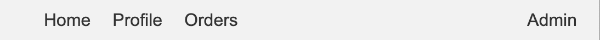

# Site header

## Description

The header serves as the primary navigation and information bar for users. It must be designed to be responsive and user-friendly, providing essential functions and access points to various parts of the application.

### Requirements

#### Requirement 1: Header states

- The header must support three different states based on the user's authentication and authorization level: Guest, General User, and Manager/Administrator.

#### Requirement 2: Guest state

- The header must display the following links for guests:
  - Sign In
  - Sign Up
  - Home (default)

#### Requirement 3: General user state

- The header must display the following links for authenticated general users:
  - Home (default)
  - Profile
  - My Orders

#### Requirement 4: Manager/Administrator state

- The header must display the same links as for general users, plus an additional "Admin" link.
- The "Admin" link must be protected by a guard to ensure only users with the appropriate role can access it.

#### Requirement 5: Additional information

- Any logo can be added.
- Authorized user name can be added.

### Acceptance Criteria

#### Acceptance Criteria 1: Guest state

- When a user is not authenticated:
  - The header must display "Home", "Sign In", and "Sign Up" links.
  - The "Home" link must redirect to the [home page](./search.md).
  - The "Sign In" link must redirect to the [sign-in page](./sign-in.md).
  - The "Sign Up" link must redirect to the [sign-up page](./sign-up.md).

#### Acceptance Criteria 2: General user state

- When a user is authenticated as a general user:
  - The header must display "Home", "Profile", and "My Orders" links.
  - The "Home" link must redirect to the [home page](./search.md).
  - The "Profile" link must redirect to the user's [profile page](./profile.md).
  - The "My Orders" link must redirect to the user's [orders page](./order.md).

#### Acceptance Criteria 3: Manager/Administrator state

- When a user is authenticated as a manager or administrator:
  - The header must display "Home", "Profile", "My Orders", and "Admin" links.
  - The "Home" link must redirect to the [home page](./search.md).
  - The "Profile" link must redirect to the user's [profile page](./profile.md).
  - The "My Orders" link must redirect to the user's [orders page](./order.md).
  - The "Admin" link must redirect to the [admin page](./admin/readme.md).
  - The "Admin" link must be accessible only to users with the manager or administrator role, enforced by a guard.

#### Acceptance Criteria 4: Guard for admin page

- The "Admin" link must be protected by a guard that checks the user's role.
- If a general user or guest tries to access the "Admin" page, they must be redirected to a "Not Authorized" page or receive an appropriate error message.

## Design example

> [!WARNING]
> All mockups should not be considered as final versions! We are providing an idea; you can come up with any design as long as it meets the functional requirements.

### Guest version

### User version

### Manager version

