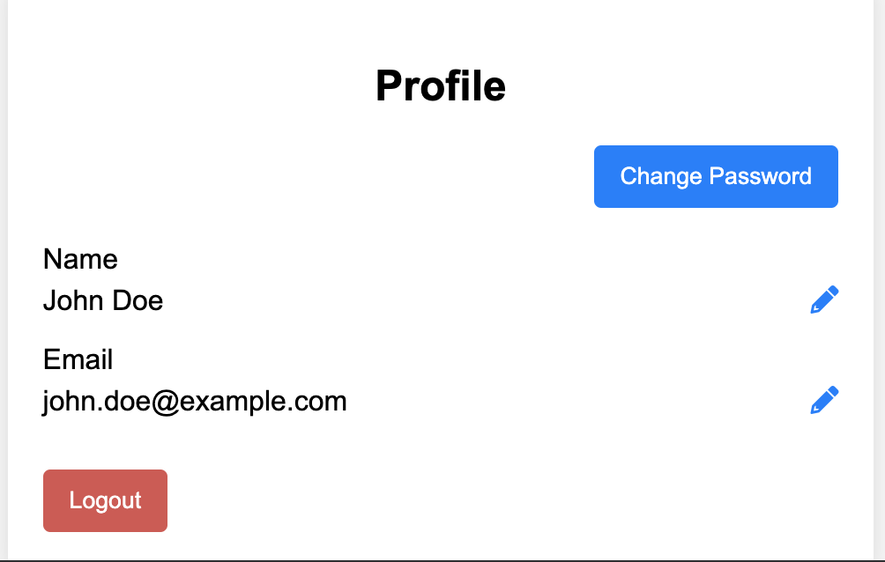
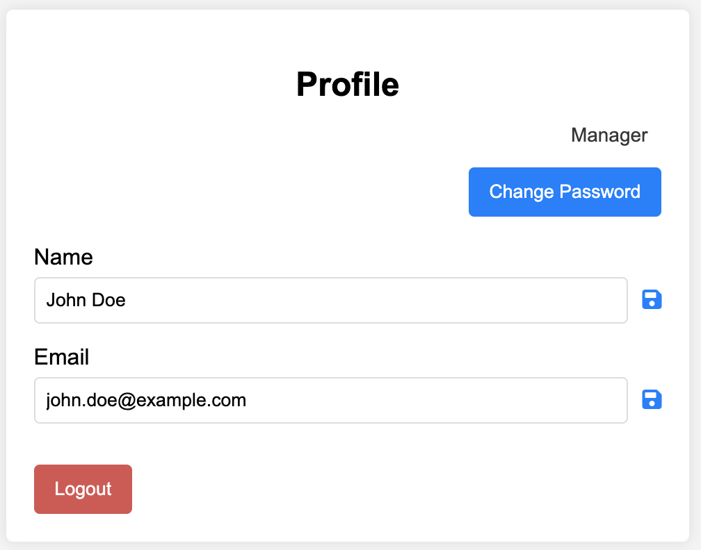
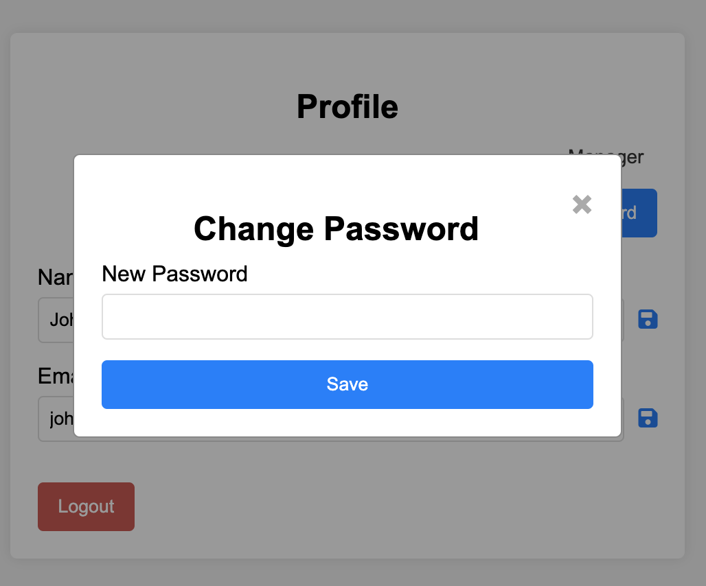

# User profile

**Browser path**: _/profile_

**Score**: 50

**Access**: only for authenticated user (run by guards)

## Description

Page allows authenticated users to view and update their personal information. Users can change details such as their _name_, _email_, and _password_.

### Core elements

- **Name record:** Name of the user.
- **Email record:** Registered user email.
- **Eedit buttons:** Pencil buttons to allow user edit information.
- **Logout button:** Button terminate current session.
- **Change password button:** Button to open dedicated modal to change current account password.

### Requirements

#### Requirement 1: User information

- The page displays the user’s name and email as text blocks.

- Each text block has an icon button that, when clicked, changes to a form field allowing the user to enter a new value and changes the "Edit" button to a "Save" button.

#### Requirement 2: Logout

- The user profile page must include a "Logout" button to terminate the user session.

- Upon successful logout, the user must be redirected to the main page.

#### Requirement 3: Password edition

- The user profile page must include a "Change Password" button.

- Clicking the "Change Password" button must open a modal window with one form field to enter the new password and a "Save" button.

- The modal window must close upon successful password change.

### Acceptance Criteria

#### Acceptance Criteria 1: Editable user name

- The user's name must be displayed as a text block with an "Edit" button.

- When the "Edit" button is clicked, the text block must turn into a form field to enter a new name, and the "Edit" button must change to a "Save" button.

- When the "Save" button is clicked, the new name must be saved, the form field must revert to a text block, and the "Save" button must change back to an "Edit" button.

#### Acceptance Criteria 2: Editable user email

- The user's email must be displayed as a text block with an "Edit" button.

- When the "Edit" button is clicked, the text block must turn into a form field to enter a new email, and the "Edit" button must change to a "Save" button.

- When the "Save" button is clicked, the new email must be saved, the form field must revert to a text block, and the "Save" button must change back to an "Edit" button.

#### Acceptance Criteria 3: Logout functionality

- The user profile page must include a "Logout" button.

- When the "Logout" button is clicked, the user session must be terminated, and the user must be redirected to the main page.

#### Acceptance Criteria 4: Change password functionality

- The user profile page must include a "Change Password" button.

- When the "Change Password" button is clicked, a modal window must open with one form field to enter the new password and a "Save" button.

- When the "Save" button in the modal window is clicked, the new password must be saved, and the modal window must close upon successful password change.

## API

### Get current user information

> `(GET) /api/profile`

- Response 200 (application/json)
  - Attributes (object)
    - name: `John Doe` (string) - User name
    - email: `user@example.com` (string) - User's email address
    - role: `manager|user` (string) - Access level

- Response 401 (application/json)
  - Attributes (object)
    - error:
      - message: `Access is not granted` (string) - Error message
      - reason: `invalidAccessToken` (string) - Wrong token idintifier

### Update user information

> `(PUT) /api/profile`

- Request (application/json)
  - Body (object)
    - email: `user@example.com` (string) - User's email address
    - name: `Dohn Doe` (string) - User's name

- Response 200 (application/json)
  - Attributes (object)
    - name: `John Doe` (string) - User name
    - email: `user@example.com` (string) - User's email address
    - role: `manager|user` (string) - Access level

- Response 401 (application/json)
  - Attributes (object)
    - error:
      - message: `Access is not granted` (string) - Error message
      - reason: `invalidAccessToken` (string) - Wrong token idintifier

- Response 400 (application/json)
  - Attributes (object)
    - error:
      - message: `Email already exists` (string) - Error message
      - reason: `invalidUniqueKey` (string) - Unique error type

### Update password

> `(PUT) /api/profile/password`

- Request (application/json)
  - Body (object)
    - password: `my-new-password` (string) - User's new password

- Response 401 (application/json)
  - Attributes (object)
    - error:
      - message: `Access is not granted` (string) - Error message
      - reason: `invalidAccessToken` (string) - Wrong token idintifier

- Response 400 (application/json)
  - Attributes (object)
    - error:
      - message: `Password is wrong` (string) - Error message
      - reason: `invalidPassword` (string) - Unique error type

### Terminate active session

> `(DELETE) /api/logout`

- Response 200 (application/json)
  - Attributes (object)

- Response 401 (application/json)
  - Attributes (object)
    - error:
      - message: `Access is not granted` (string) - Error message
      - reason: `invalidAccessToken` (string) - Wrong token idintifier

## Design examples

> [!WARNING]
> All mockups should not be considered as final versions! We are providing an idea; you can come up with any design as long as it meets the functional requirements.

### Profile page for user

### Profile page for manager

### Profile page change password modal

## Next section

- [Home page](./home.md)
- [Manager page](./admin)
