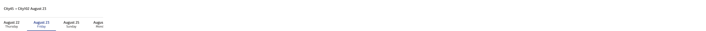

# Home Page

**Browser path**: _/_

**Score**: 70

## Description

User can book train tickets simply enter his departure and destination points, select travel date and time, and browse through a list of available trains.

To get from one point to another, user need to find a route between stations as well as the date of a possible trip.

A **station** is a place where a train arrives in a city, like a terminal, which is clearly connected to some other stations. A train can only move between stations that are connected to each other. _There can be only one station in a city._

A **carriage** is a structure for transporting passengers with specific parameters. The type of carriage is configured by:

- the number of rows of passenger seats
- the number of seats to the left of the aisle in a row
- the number of seats to the right of the aisle in a row

A **route** is a set of connected stations that a train travels through with a specific list of carriages. A train can consist of carriages of different types in any order and in any quantity. A route does not have a direct association with travel time.

A **schedule** or **ride** is a precisely defined time for a train’s journey between first and last stations on the route, indicating the _price for each type of carriage for each segment between stations_, so that passengers can pay only for the trip between the desired stations.

Apart from ride, the **trip** is a journey between selected stations by user. It is part of ride.

### Core elements

- **Search section**:
  - **Form field _From_**: Where the trip starts
  - **Form field _To_**: Where the trip ends
  - **Form field _Date_**: From what date to search
    - **Search**: Button to initiate the search process
- **Result list item**:
  - **Arrival date/time**: When a train reaches the station
  - **Departure date/time**: When a train departs from the station
  - **Duration**: Travel time
  - **Carriage(s)**: Carriage type(s) with free seats and price

### Requirements: Search section [(design 1)](#search-block-1)

#### Requirement 1: Start City Field

- The form must include a field to define the city where the trip starts.
- This field must have an autocomplete function to assist users in selecting the city.

#### Requirement 2: End City Field

- The form must include a field to define the city where the trip ends.
- This field must have an autocomplete function to assist users in selecting the city.

#### Requirement 3: Date/Time Field

- The form must include a calendar field to specify the minimal date and time of the trip.

#### Requirement 4: Submit Button

- The form must include a submit button.
- The submit button must be disabled until the form is valid (all fields are correctly filled).

### Acceptance Criteria: Search section [(design 1)](#search-block-1) (20)

#### Acceptance Criteria 1: Start city field autocomplete (6)

> [!WARNING] > **Technical quirk**  
> Developer should obtain coordinates of the location through whatever external services they want while user fills city name in the form field.

- The form must include a field labeled "From" for the start city.
- When the user begins typing in the "From" field, an autocomplete dropdown must appear with city suggestions.
- The user must be able to select a city from the autocomplete suggestions.

#### Acceptance Criteria 2: End city field autocomplete (6)

> [!WARNING] > **Technical quirk**  
> Developer should obtain coordinates of the location through whatever external services they want while user fills city name in the form field.

- The form must include a field labeled "To" for the end city.
- When the user begins typing in the "To" field, an autocomplete dropdown must appear with city suggestions.
- The user must be able to select a city from the autocomplete suggestions.

#### Acceptance Criteria 3: Calendar field (6)

- The form must include a field labeled "Date/Time" for specifying the date and optional time of the trip.
- The user must be able to select a date from a calendar that only allows future days.
- The time selection must be optional and only available if a date is selected.

#### Acceptance Criteria 4: Submit button validation (2)

- The form must include a submit button labeled "Search".
- The submit button must remain disabled until the "From", "To", and "Date/Time" fields are all filled and valid.
- Once all fields are valid, the submit button must become enabled.

### Requirements: Filter [(design 2)](#filter-2)

#### Requirement 1: Display of dates and days

- The inline tabs must display each date in the format "MMMM dd" (e.g., "August 01").
- Each tab must also display the corresponding day name (e.g., "Monday").

#### Requirement 2: Clickable tabs

- Each tab must be clickable and must allow the user to select a specific date.
- Clicking on a tab must update the list of train rides to show the rides available for the selected date.

#### Requirement 3: Highlighting selected tab

- The currently selected tab must be visually highlighted to indicate the active selection.

#### Requirement 4: Data binding

- The tabs must dynamically reflect the search results, displaying only the dates for which there are available train rides.
- The list of train rides must update accordingly when a tab is selected.

#### Requirement 5: Responsive design

- The inline tabs must be responsive and must display correctly on various devices (mobile, tablet, desktop).

### Acceptance Criteria: Filter [(design 2)](#filter-2) (15)

#### Acceptance Criteria 1: Display dormat (2)

- Each tab must display the date in the format "MMMM dd" (e.g., "August 01") and the corresponding day name (e.g., "Monday").

#### Acceptance Criteria 2: Clickable functionality (2)

- When a user clicks on a tab, the list of train rides must update to show the rides available for the selected date.
- Each tab must be individually clickable.

#### Acceptance Criteria 3: Visual highlighting of selected tab (2)

- The selected tab must be visually highlighted to indicate it is the active selection.
- Only one tab can be highlighted at a time.

#### Acceptance Criteria 4: Reflecting search results (7)

- The tabs must dynamically display only the dates for which there are available train rides based on the search results.
- When a tab is selected, the corresponding train rides for that date must be displayed.

#### Acceptance Criteria 5: Responsive Design (2)

- The inline tabs must display correctly and be fully functional on mobile, tablet, and desktop devices.
- The layout must adjust to ensure usability across different screen sizes.

### Requirements: Result list ([design 3](#result-list-3))

#### Requirement 1: Display structure

- The result list must display either a grouped array of train movement or a message indicating that no rides are available.
- Each item in the list must have an "information section" with stations and a "price section" with a cost of trip for each carriage type.
- Each item is clickable for whole area and redirects user to the detail page, when user can make an order.

#### Requirement 2: Information section

- The information section must display the departure time, arrival time, and the corresponding dates of the trip.
- The start city and end city of the trip (that user selected) must be displayed.
- The trip duration must be shown.
- There must be a "Route" button that opens a modal window with all stations in the route.
- The start and end stations of the route must be displayed.

#### Requirement 3: Price section

- The price section must display a dynamic list of unique carriage types with certain data.
- For each carriage type, the number of free seats and the price for the trip (between the selected stations) must be displayed.

#### Requirement 4: Message for no rides available

- If no rides are available, a message indicating that no rides are available must be displayed.

### Acceptance Criteria: Result list ([design 3](#result-list-3)) (25)

#### Acceptance Criteria 1: Display of train rides (6)

- The result list must display train rides grouped by day.
- Each item must have an "information section" and a "price section" with the specified content.
- The list of results must be grouped by day from the filter, showing available routes for each day.
- Each item is clickable for whole area and redirects user to the [detail page](./search-detail.md), when user can make an order.

#### Acceptance Criteria 2: Information section (8)

- The departure time, arrival time, and corresponding dates must be displayed.
- The start city and end city of the trip (that user selected) must be displayed.
- The trip duration must be shown between dates.
- A "Route" button must be present and, when clicked, must open a modal window showing all stations in the route.
- The start and end stations of the route must be displayed below.

#### Acceptance Criteria 3: Price section (8)

- The price section must display a list of unique carriage types as a area.
- Each carriage area must display the name of carriage, number of free seats, and the price for the ride between the selected stations (that user selected).

#### Acceptance Criteria 4: Message for no rides available (3)

- If there are no available rides, a specific message such as "No rides available" must be displayed.

### Requirements: Trip detail ([design 4](#result-trip-details-4))

#### Requirement 1: Route button functionality

- Each result item element must include a "Route" button.
- Clicking the "Route" button must trigger a modal window.

#### Requirement 2: Modal window content

- The modal window must display the trip start station, trip end station, and all intermediate stations of the trip.
- The list of intermediate stations must be accurate and correspond to the specific route.

#### Requirement 3: User Interaction

- The modal window must be dismissible by the user, either by clicking a close button or by clicking outside the modal window.

### Acceptance Criteria: Trip detail ([design 4](#result-trip-details-4)) (10)

#### Acceptance Criteria 1: Route button presence (1)

- Each result item element must have a "Route" button that is clearly visible.

#### Acceptance Criteria 2: Modal window trigger (2)

- When the "Route" button is clicked, a modal window must appear.

#### Acceptance Criteria 3: Modal window content (5)

- Title of modal contains text "Route" along with route id number.

- The modal window must display:

  - The start station of the trip at the top.
  - The end station of the trip at the bottom.
  - All intermediate stations between the start and end stations listed in order.

- For each station:
  - Display the departure time in the first column (except for the last station).
  - Display the arrival time in the first column (except for the first station).
  - City name in the secord column
  - Dwell time at each station in the third column.

#### Acceptance Criteria 4: User interaction (2)

- The modal window must include a close button.
- The modal window must also close when the user clicks outside of it.
- The modal window must remain open and display correctly until the user dismisses it.
- Internal content could have vertical scrolling if necessary.

## API

### Search

> [!NOTE]
> Endpoint provides general information. Developer should independently calculate required information on the page based on the http-response.

> [!IMPORTANT]
> The coordinates of the points must be passed that which the search will be performed by!

> `(GET) /api/search`

- Request (application/json)

  - Attributes: (object)
    - fromLatitude: `48.8575` (number, required) - Latitude of the start city
    - fromLongitude: `2.3514` (number, required) - Longitude of the start city
    - toLatitude: `40.4167` (number, required) - Latitude of the end city
    - toLongitude: `3.7033` (number, required) - Longitude of the end city
    - time: `1723669200000` (number, optional) - unix timestamp of the trip

- Response 200 (application/json)

  - Attributes: (object)
    - from: (object) - set of data about start point
      - stationId: `5` (number) - Unique station identifier
      - city: `Paris` (string) - City name
      - geolocation: (object) Station coordinates
        - latitude: `48.8575` (number) - Latitude of the start station
        - longitude: `2.3514` (number) - Longitude of the start station
    - to: (object) - set of data about end point
      - stationId: `48` (number) - Unique station identifier
      - city: `Madrid` (string) - City name
      - geolocation: (object) Station coordinates
        - latitude: `40.4167` (number) - Latitude of the end station
        - longitude: `3.7033` (number) - Longitude of the end station
    - routes: (array[object]) - List of available routes
      - id: `64` (number) - Route identifier
      - path: `[33, 5, 62, 11, 48, 34]` (array[number]) - List of station identifiers
      - carriages: `['carriage_type_2', 'carriage_type_2', 'carriage_type_2', 'carriage_type_2', 'carriage_type_7', 'carriage_type_7', 'carriage_type_7', 'carriage_type_7']` (array[string]) - List of carriage types for the train
      - schedule: (array[object]) - List of potential rides
        - rideId: `44` (number) - Identifier of certain schedule for the route
        - segments: (array[object]) - List of road section between each station. Always 1 less than the number of stations on the route
          - time: `['2024-08-08T22:19:57.708Z', '2024-08-12T03:29:57.708Z']` (array[string]) - dates of the start of movement on the section and the end of movement on the section in string form - [departure_from_prev_station, arrival_at_next_station]
          - price: (object) - set of prices for all carriage types on this route. It has vary size depending on the train configuration
            - dynamic-carriage-type-1: `210` (number) - the price of 210 units for _dynamic-carriage-type-1_ carriage type on current section
          - occupiedSeats: (array[number]) - list of occupied seat numbers

- Response 400 (application/json)

  - Attributes (object)
    - error:
      - message: `Start station not found` (string) - Error message
      - reason: `stationNotFound` (string) - Error type

- Response 400 (application/json)
  - Attributes (object)
    - error:
      - message: `End station not found` (string) - Error message
      - reason: `stationNotFound` (string) - Error type

## Design example

> [!WARNING]
> All mockups should not be considered as final versions! We are providing an idea; you can come up with any design as long as it meets the functional requirements.

### Search block (1)

#### Search form

##### Mobile

##### Tablet

##### Desktop

#### City autocomplete

Using any external service to obtain the coordinates of the city.

#### Calendar selection

### Filter (2)

#### Date filter

##### Mobile

##### Desktop

### Result list (3)

#### None available routes are found (desktop, tablet, mobile)

#### Available rides for selected day

##### Mobile

Carriage types on the bottom

##### Desktop

Carriage types on the right

### Result trip details (4)

#### Modal window with trip stations (desktop, tablet, mobile)

## Next section

- [Trip](./search-detail.md)
