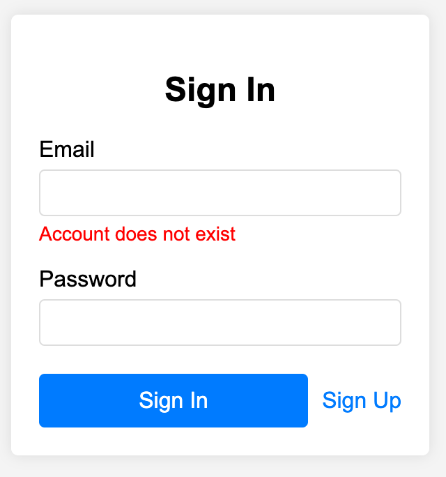

# User login

**Browser path**: _/signin_

**Score**: 30

**Access**: only for guests (run by guards)

## Description

User can enter _email_ and _password_ into relative form fields and be granted to use personal functions.

### Core elements

- **Email field**: Where users input their login credentials.
- **Password field**: For secure password entry.
- **Sign In button** To initiate the login process.
- **Sign Up link**: To navigate user to Sign-Up page.

> [!IMPORTANT]
> Password recovery is not supported. If a user forgets their password, they will lose access to the system.

### Requirements

#### Requirement 1: User Authentication

- The system must allow users to sign in using their email and password.
- The system should securely authenticate users based on the credentials provided.
- The Sign-In page should have fields for email and password input.

#### Requirement 2: User Experience

- The Sign-In page should display appropriate error messages for incorrect email/password combinations.
- The Sign-In page should be responsive and work on various devices (mobile, tablet, desktop).

#### Requirement 3: Response & Token

- User can click "Sign In" button only once during http-request execution. If authentication was successful - browser receives token, save it into `localStorage` and follow the [instructions](./readme.md#authorization-token).

### Acceptance Criteria (30)

#### Acceptance Criteria 1: Access control (5)

- User should be authenticated and redirected to the homepage upon entering valid email and password.
- Once signed in, the user should not be able to access the Sign-In page again until they log out.
- If an authenticated user tries to access the Sign-In page directly via the browser URL, they should be redirected to the [Homepage](./home.md).
- After successful authentication each following http-requests must comply with [Authorization record](./readme.md#authorization-token)

#### Acceptance Criteria 2: Error message for incorrect password (5)

- User can fill any symbols in any languages.
- Display "_Incorrect email or password_" error message under Email and Password fields when user click "Sign In" button with existing email but incorrect password for that account.
- Errors appear when user click on "Sign In" button and receive 400 error.
- Error under field that is being edited disappears when user changes this field content.

#### Acceptance Criteria 3: Error message for email (5)

- Display "_Incorrect email or password_" error message under Email and Password fields when user click "Sign In" button with existing email but incorrect password for that account. Error disappears when user changes Email field content.
- Display "_Incorrect email_" error message under Email field if user changes content of email field after clicking on "Sign In" button and it does not match _^[\w\d\_]+@[\w\d\_]+\.\w{2,7}$_ regular expression.
- Errors appear when user click on "Sign In" button and receive 400 error.

#### Acceptance Criteria 4: Error message for empty field (5)

- Display "_Required_" error message under the empty form fields **after** "Sign In" button is clicked first time. Error does not appear until user click button regardless of content.

#### Acceptance Criteria 5: Disabled Sign In button (5)

- Button "Sign In" is disabled until user fill email in correct format and password is not empty. User cannot click it.
- Button "Sign In" is disabled during the authentication process.

#### Acceptance Criteria 6: Responsive design (5)

- The Sign-Up page must display correctly and be fully functional on mobile, tablet, and desktop devices.

### User Flow

#### User Scenario 1: Successful Sign-In

**Objective**: Verify that a user can successfully sign in with valid credentials.

- Navigate to Sign-In page
  - **Action**: Open the browser and go to _/signin_.
  - **Expected Result**: The Sign-In page is displayed.
- Enter email and password
  - **Action**: Input existing email into the Email field and corresponding account password into the Password field.
  - **Expected Result**: The "Sign In" button becomes enabled.
- Click "Sign In" button
  - **Action**: Click the "Sign In" button.
  - **Expected Result**:
    - The button is disabled during the authentication process.
    - The system sends a request to [_/api/signin_](#sign-in-user) with the email and password.
    - The server responds with a 201 status and an authentication token.
    - The token is saved in localStorage.
    - The user is redirected to the [Homepage](./search.md).
- Verify access control
  - **Action**: Attempt to access the Sign-In page again.
  - **Expected Result**: The user is redirected to the [Homepage](./search.md).

#### User Scenario 2: Invalid email format with no visible errors

**Objective**: Verify that the frontend validates email format correctly.

- Navigate to Sign-In page
  - **Action**: Open the browser and go to _/signin_.
  - **Expected Result**: The Sign-In page is displayed with the "Sign In" button initially disabled.
- Enter invalid email format and any password
  - **Action**: Input `invalid-email` into the Email field and `Password123` into the Password field.
  - **Expected Result**: The "Sign In" button remains disabled if the email does not match the regex pattern, regardless of the password. No visible errors.
- Click "Sign In" button
  - **Action**: Click the "Sign In" button.
  - **Expected Result**: Nothing happens. The button is disabled because of wrong email.

#### User Scenario 3: Incorrect password with no visible errors

**Objective**: Verify that the system handles incorrect passwords correctly.

- Navigate to Sign-In page
  - **Action**: Open the browser and go to /signin.
  - **Expected Result**: The Sign-In page is displayed with the "Sign In" button initially disabled.
- Enter email in valid format and empty password
  - **Action**: Input `user@example.com` into the Email field and left empty Password field.
  - **Expected Result**: The "Sign In" button remains disabled. No visible errors.
- Enter empty password
  - **Action**: Input any number of spaces.
  - **Expected Result**: The "Sign In" button remains disabled no matter how many empty characters are written. No visible errors.
- Click "Sign In" button
  - **Action**: Click the "Sign In" button.
  - **Expected Result**: Nothing happens. The button is disabled because of wrong password. No visible errors.
- Enter any password
  - **Action**: Input any non-empty string of any length into Password field.
  - **Expected Result**: The "Sign In" button becomes enabled and user is able to click it. No visible errors.
- Clear the Password field
  - **Action**: Remove all content from the Password field.
  - **Expected Result**: The "Sign In" buttons turns back to disabled. No visible errors.

#### User Scenario 4: Invalid email in credentials

**Objective**: Verify that user can see failed authentication.

- Navigate to Sign-In page
  - **Action**: Open the browser and go to /signin.
  - **Expected Result**: The Sign-In page is displayed with the "Sign In" button initially disabled.
- Enter email and password
  - **Action**: Input non-existing email in correct format into the Email field and any password into the Password field.
  - **Expected Result**: The "Sign In" button becomes enabled. No visible errors.
- Click "Sign In" button
  - **Action**: Click the "Sign In" button.
  - **Expected Result**:
    - The button is disabled during the authentication process.
    - The system sends a request to [_/api/signin_](#sign-in-user) with the email and password.
    - The server responds with a 400 status and error message.
    - An error message "_Incorrect email or password_" is displayed under the Email and Password fields.
    - Button "Sign In" turns to disabled because fields have errors.
- Change the email
  - **Action**: Start editing the email to any other one.
  - **Expected Result**:
    - Errors are removed for both fields.
    - There are no errors if Email contains value in correct format (match regular expression). "Sign In" button is active.
    - Error message "_Incorrect email_" is displayed under Email field if it contains value in wrong format (does not match regular expression). "Sign In" button is disabled.
    - Error message "_Required_" is displayed if Email field is empty. "Sign In" button is disabled.

#### User Scenario 5: Invalid password in credentials

**Objective**: Verify that user can see failed authentication.

- Navigate to Sign-In page
  - **Action**: Open the browser and go to /signin.
  - **Expected Result**: The Sign-In page is displayed with the "Sign In" button initially disabled.
- Enter email and password
  - **Action**: Input existing email in correct format into the Email field and any wrong non-empty password into the Password field.
  - **Expected Result**: The "Sign In" button becomes enabled. No visible errors.
- Click "Sign In" button
  - **Action**: Click the "Sign In" button.
  - **Expected Result**:
    - The button is disabled during the authentication process.
    - The system sends a request to [_/api/signin_](#sign-in-user) with the email and password.
    - The server responds with a 400 status and error message.
    - An error message "_Incorrect email or password_" is displayed under the Email and Password fields.
    - Button "Sign In" turns to disabled because fields have errors.
- Change the password
  - **Action**: Start editing the password to any other one.
  - **Expected Result**:
    - Errors are removed for both fields.
    - There are no errors if Password contains any non-empty value. "Sign In" button is active.
    - Error message "_Required_" is displayed if Password field is empty or contains only spaces. "Sign In" button is disabled.

#### User Scenario 6: Responsive design

**Objective**: Verify that the Sign-In page is responsive on various devices.

- Navigate to Sign-In page
  - **Action**: Open the browser and go to _/signin_ on different devices (mobile, tablet, desktop).
  - **Expected Result**: The Sign-In page displays correctly and is fully functional on mobile, tablet, and desktop devices.

## API

### Sign In User

> `(POST) /api/signin`

- Request (application/json)

  - Body (object)
    - email: `user@example.com` (string, required) - User's email address
    - password: `Password123` (string, required) - User's password

- Response 201 (application/json)

  - Attributes (object)
    - token: `eyJhbGciOiJIUzI1NiIsInR5cCI6IkpXVCJ9...` (string, required) - Authentication token

- Response 400 (application/json)

  - Attributes (object)
    - error:
      - message: `Fields are empty` (string) - Error message
      - reason: `invalidFields` (string) - Unique error type

- Response 400 (application/json)

  - Attributes (object)
    - error:
      - message: `Email is wrong` (string) - Error message
      - reason: `invalidEmail` (string) - Unique error type

- Response 400 (application/json)

  - Attributes (object)
    - error:
      - message: `User is not found` (string) - Error message
      - reason: `userNotFound` (string) - Unique error type

- Response 400 (application/json)
  - Attributes (object)
    - error:
      - message: `Authorization error` (string) - Error message
      - reason: `alreadyLoggedIn` (string) - Unique error type

## Design example

> [!WARNING]
> All mockups should not be considered as final versions! We are providing an idea; you can come up with any design as long as it meets the functional requirements.

### Sign In page example

## Next Section

- [Profile page](./profile.md)
