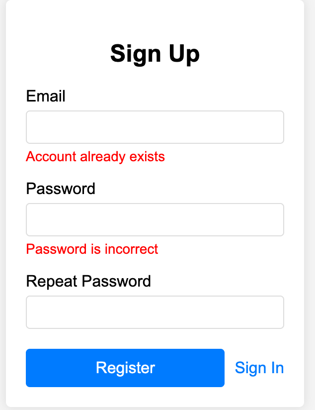

# Sign-Up Page

**Browser path**: _/signup_

**Score**: 30

**Access**: only for guests (run by guards)

## Description

User is able to enter _email_ and _password_ into the relative fields and create new account to get personal service.

### Core elements

- **Email field**: Where users input their login credentials.
- **Password field**: For secure password entry.
- **RepeatPassword field**: To duplicate password value.
- **Register button**: To initiate the register process.
- **Sign In link**: To navigate user to Sign-In page.

> [!IMPORTANT]
> Password recovery is not supported. If a user forgets their password, they will lose access to the system.

### Requirements

#### Requirement 1: User Registration

- The system must allow users to sign up using their email, password, and repeat password fields.
- The Sign-Up page should include a "Register" button and a "Sign In" link for users who already have an account.

#### Requirement 2: Password Validation

- The system must ensure that the password consists of at least 8 symbols.
- The system must validate that the password and repeat password fields match.

#### Requirement 3: Error Handling

- The Sign-Up page should display appropriate error messages if the password and repeat password fields do not match.
- The Sign-Up page should display an error message if an account with the provided email already exists.

#### Requirement 4: User Experience

- The Sign-Up page should be responsive and work on various devices (mobile, tablet, desktop).
- The Sign-Up page should provide a clear and user-friendly interface.

### Acceptance Criteria (30)

#### Acceptance Criteria 1: Access control (5)

- User should be able to register with a valid email, password, and matching repeat password, and should be redirected to a [Sign-In page](./sign-in.md) page upon successful registration.

#### Acceptance Criteria 2: Password validation error (5)

- User can fill any symbols in any languages.
- Display "_Passwords do not match_" error message when the Password and RepeatPassword fields do not match.
- Display "_Password must be at least 8 characters long_" error message when the password is less than 8 characters.

#### Acceptance Criteria 3: Email already exists error (5)

- Display "_Account with this email already exists_" error message when the user tries to sign up with an email that is already registered.
  - Errors appear when user click on "Register" button and receive 400 error with _invalidUniqueKey_ reason.
  - Error under field that is being edited disappears when user changes this field content.
- Display "_Incorrect email_" error message under Email field if user changes content of email field after clicking on "Register" button and it does not match _^[\w\d\_]+@[\w\d\_]+\.\w{2,7}$_ regular expression.

#### Acceptance Criteria 4: Error message for empty field (5)

- Display "_Required_" error message under the empty Email and Password fields **after** "Register" button is clicked first time. Error does not appear until user click button regardless of content.
- RepeatPassword field has only 1 error message "_Passwords do not match_" if it is not empty but does not match the original password.

#### Acceptance Criteria 5: Disabled Sign Up button (5)

- Button "Register" is disabled until user fills email in correct format and password matches the restriction. User cannot click it.
- Button "Register" is disabled during the registration process.

#### Acceptance Criteria 6: Responsive design (5)

- The Sign-Up page must display correctly and be fully functional on mobile, tablet, and desktop devices.

### User Flow

Imagine you’re looking at the most beautiful registration form in the world. You’re enjoying every aspect of its majestic design... and just as you’re about to enter your email address, :fire: :boom: :collision: – errors pop up because the email format is incorrect, even though you haven’t finished typing it yet. It’s frustrating to be interrupted with errors before you’ve even had a chance to complete your input.

When designing a registration form, it’s important to show errors to the user in the right way. There are two stages of validation: on the frontend and backend. On the frontend, errors are only shown after the user attempts to submit the form. This helps to avoid unnecessary concerns during data entry.

However, if passwords need to match, errors for mismatched passwords should be shown immediately, as users cannot see the entered passwords. For other types of errors, they are displayed only after the form is submitted and a 400 error is received from the server. This approach simplifies the form’s use and makes it more user-friendly.

#### User Scenario 1: Successful Sign-Up

**Objective**: Verify that a user can successfully sign up with valid credentials.

- Navigate to Sign-Up page
  - **Action**: Open the browser and go to _/signup_.
  - **Expected Result**: The Sign-Up page is displayed.
- Enter email and password
  - **Action**: Input new email into the Email field and any password 8+ symbols into the Password field.
  - **Expected Result**: The "Register" button becomes enabled.
- Click "Register" button
  - **Action**: Click the "Register" button.
  - **Expected Result**:
    - The button is disabled during the registration process.
    - The system sends a request to [_/api/signup_](#sign-up-user) with the email and password.
    - The server responds with a 201 status
    - The user is redirected to the [Sign-In](./sign-in.md) page.

#### User Scenario 2: Invalid email format with no visible errors

**Objective**: Verify that the frontend validates email format correctly.

- Navigate to Sign-Up page
  - **Action**: Open the browser and go to _/signup_.
  - **Expected Result**: The Sign-Up page is displayed with the "Register" button initially disabled.
- Enter invalid email format and any password
  - **Action**: Input `invalid-email` into the Email field, `Password123` into the Password field and `Password123` into RepeatPassword field.
  - **Expected Result**: The "Register" button remains disabled if the email does not match the regex pattern, regardless of the password. No visible errors.
- Click "Register" button
  - **Action**: Click the "Register" button.
  - **Expected Result**: Nothing happens. The button is disabled because of wrong email.

#### User Scenario 3: Incorrect repeat password

**Objective**: Verify that user can proceed entering the same password twice.

- Navigate to Sign-Up page
  - **Action**: Open the browser and go to _/signup_.
  - **Expected Result**: The Sign-Up page is displayed with the "Register" button initially disabled.
- Enter email in correct format
  - **Action**: Input `user@example.com` into the Email field.
  - **Expected Result**: The "Register" button remains disabled because Password is empty. No visible errors.
- Enter password
  - **Action**: Input `Password123` into the Password field.
  - **Expected Result**: The "Register" button remains disabled because RepeatPassword is empty. No visible errors.
- Repeat password with deviation
  - **Action**: Input `Password321` into the RepeatPassword field.
  - **Expected Result**: The "Register" button remains disabled because RepeatPassword is different. Error message "_Passwords do not match_" is displayed under RepeatPassword field when value is not empty and does not match the original password.
- Change the password
  - **Action**: Clear the RepeatPassword field and input `Password123` there.
  - **Expected Result**:
    - Errors are not displayed.
    - "Register" button is enabled.

#### User Scenario 4: Incorrect password with no visible errors

**Objective**: Verify that the system handles incorrect passwords correctly.

- Navigate to Sign-Up page
  - **Action**: Open the browser and go to _/signin_.
  - **Expected Result**: The Sign-Up page is displayed with the "Register" button initially disabled.
- Enter email in valid format and empty password
  - **Action**: Input `user@example.com` into the Email field and left empty Password field.
  - **Expected Result**: The "Register" button remains disabled. No visible errors.
- Enter empty password
  - **Action**: Input any number of spaces.
  - **Expected Result**: The "Register" button remains disabled no matter how many empty characters are written. No visible errors.
- Click "Register" button
  - **Action**: Click the "Register" button.
  - **Expected Result**: Nothing happens. The button is disabled because of wrong password. No visible errors.
- Enter short password
  - **Action**: Input any non-empty string less than 8 characters into Password and RepearPassword fields.
  - **Expected Result**: The "Register" button remains disabled because password does not comply with length restriction. No visible errors.
- Enter long password
  - **Action**: Add few characters into the Password and RepeatPassword fields so that the length is not less than 8.
  - **Expected Result**: The "Register" button becomes enabled and user is able to click it. No visible errors.

#### User Scenario 5: Email is already used

**Objective**: Verify that user can see failed registration.

- Navigate to Sign-Up page
  - **Action**: Open the browser and go to _/signup_.
  - **Expected Result**: The Sign-Up page is displayed with the "Register" button initially disabled.
- Enter email and password
  - **Action**: Input existing email in correct format into the Email field, corresponding account password into the Password field and the same password into RepeatPassword field.
  - **Expected Result**: The "Register" button becomes enabled. No visible errors.
- Click "Register" button
  - **Action**: Click the "Register" button.
  - **Expected Result**:
    - The button is disabled during the registration process.
    - The system sends a request to [_/api/signup_](#sign-up-user) with the email and password.
    - The server responds with a 400 status and _invalidUniqueKey_ reason.
    - An error message "_Account with this email already exists_" is displayed under the Email field.
    - Button "Register" turns to disabled because Email field have error.
- Change the email
  - **Action**: Start editing the email to any other one.
  - **Expected Result**:
    - Error "_Account with this email already exists_" is removed for Email field.
    - There are no errors if Email contains value in correct format (match regular expression). "Register" button is active.
    - Error message "_Incorrect email_" is displayed under Email field if it contains value in wrong format (does not match regular expression). "Register" button is disabled.
    - Error message "_Required_" is displayed if Email field is empty. "Register" button is disabled.

#### User Scenario 6: Responsive design

**Objective**: Verify that the Sign-Up page is responsive on various devices.

- Navigate to Sign-Up page
  - **Action**: Open the browser and go to _/signup_ on different devices (mobile, tablet, desktop).
  - **Expected Result**: The Sign-Up page displays correctly and is fully functional on mobile, tablet, and desktop devices.

## API

### Sign Up User

> `(POST) /api/signup`

- Request (application/json)

  - Body (object)
    - email: `user@example.com` (string, required) - User's email address
    - password: `Password123` (string, required) - User's password

- Response 201 (application/json)

  - Attributes (object)

- Response 400 (application/json)

  - Attributes (object)
    - error:
      - message: `Fields are empty` (string) - Error message
      - reason: `invalidFields` (string) - Unique error type

- Response 400 (application/json)

  - Attributes (object)
    - error:
      - message: `Email is wrong` (string) - Error message
      - reason: `invalidEmail` (string) - Unique error type

- Response 400 (application/json)

  - Attributes (object)
    - error:
      - message: `Password is wrong` (string) - Error message
      - reason: `invalidPassword` (string) - Unique error type

- Response 400 (application/json)
  - Attributes (object)
    - error:
      - message: `User already exists` (string) - Error message
      - reason: `invalidUniqueKey` (string) - Unique error type

## Design example

> [!WARNING]
> All mockups should not be considered as final versions! We are providing an idea; you can come up with any design as long as it meets the functional requirements.

### Sign Up page example

## Next section

- [Sign In page](./sign-in.md)
