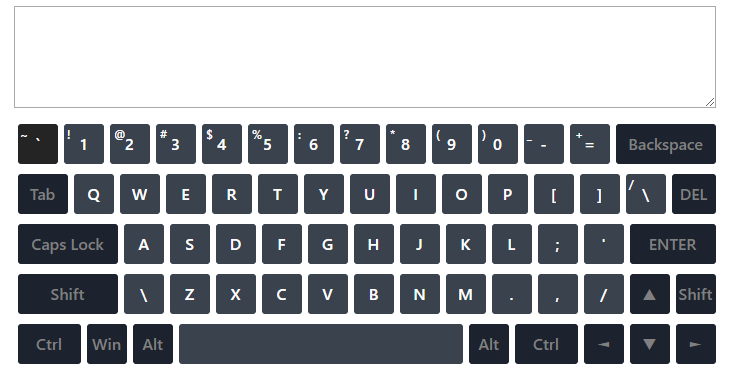
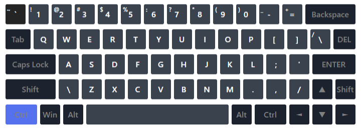

# RSS Virtual Keyboard

#### You should create a virtual keyboard like this:



### Functional requirements:

- design is at your discretion.
- `index.html` file should be empty (all the necessary elements are generated with the usage of JS)
- pressing a key on a physical keyboard highlights the key on the virtual keyboard:
  

  **There may be differences in keystrokes on different operating systems (Windows, macOS). To avoid mistakes, it's necessary to specify in which OS the virtual keyboard was created**

- if several buttons are pressed, all the pressed buttons are highlighted on the virtual keyboard (there're no exceptions for `Ctrl`, `Alt` and `Shift` as well)
  
- the virtual keyboard is able to switch between two language layouts (English + any other language).
  - assigning a keyboard shortcut for switching keyboard layout is up to you.
  - the buttons on the virtual keyboard display symbols of a selected language
  - the application saves a chosen language after the page is reloaded and displays the keyboard on that language
  - the keyboard shortcut for changing language should be indicated on the page so that it will be clear for a user how to switch keyboard layout
- keystrokes are animated
- clicks on the buttons with a mouse on the virtual keyboard and pressing keys on a physical keyboard should input symbols to the text area located on the page above the virtual keyboard.
  - pressing the `Up`, `Down`, `Left` or `Right` arrow key inputs an arrow symbol in the input field, or implements navigation on the text area.
  - pressing the `Enter` should move a text cursor to the next line
  - the `Tab` key creates a horizontal indent
  - pressing the rest of the function keys on a keyboard does not result in inputting symbols
  - the `Backspace` key removes character before the text cursor
  - the `Del` key removes character after the text cursor
  - the `Shift`, `Alt`, `Ctrl`, `Caps lock` and `Space` keys should work as on a real keyboard

### Technical requirements

- should work on the latest Chrome version
- usage of JQuery and other JS libraries is **not allowed**
- usage of Bootstrap and other UI libraries is **not allowed**
- usage of Angular/React/Vue and other frameworks is **not allowed**
- you can use CSS preprocessors
- [ESLint (eslint-config-airbnb-base)](https://eslint.org/) should be used. It is allowed to add to the .eslintrc.js file ignoring the 'import/extensions' rule in case of using modules and needing to import them into the main file.
- the working application should be hosted on [GitHub Pages](https://pages.github.com/). It happens automatically on 'gh-pages' branch creation. Afterward, the page will be available at the address like https://your-github-account.github.io/name-of-your-repository

### Requirements for commits, pull request, repository

- the work should be done in your private repository
- the repository name matches the task name (virtual-keyboard).
- source code should be committed to a separate branch
- the **main** branch should be empty (contain only files like README.md or .gitignore)
- commit messages should follow the [guideline](https://www.conventionalcommits.org/en)
- once the work is finished, create a pull request from a **development** branch to **main**
- the pull request name should contain **the task name**
- the pull request description should contain the following information:
  - link to the task
  - screenshot of your application (one would be enough)
  - link to your application
  - date of completion/deadline
  - your self-check with a preliminary evaluation that is based on the evaluation criteria from the task

Example:

```
1. Task:
   Link to the current is here
2. App screenshot:
   Your screenshot is here
3. Deploy:
   A link to your deployed application is here
4. Done 19.04.20 (deadline 19.04.20)
5. Score: 200 / 200
- [x] Minimal scope
    - [x] Feature 1 is implemented (+10)
    - [x] Feature 2 is implemented (+10)
- [x] Basic scope
    - [x] Feature 3 is implemented (+10)
    - [x] Feature 4 is implemented (+10)
- [x] Extra scope
    - [x] Feature 5 is implemented (+10)
    - [x] Feature 6 is implemented (+10)
- [x] Technical requirements
    - [x] ESLint is used (+10)
    - [x] ES6 features are used (+10)
    - [x] Requirements to the repository, commits and pull request are met (+10)
- [x] Penalties
    - [x] Errors while app's working. (-10 for each, but no more than the total number of points for requirement implementation)
    - [x] Not comply with the requirements for Pull Request, repository, commits names (-10) scores by mentor
```

- Pull request `should not contain commented code, redundant files, changes from other branches and generated files`, for instance, `.bundle.js`. Please, check your changes before creating a pull request. `.editorconfig`, `.gitignore`, etc. could be included in your pull request
- Comments on a PR is a good practice
- [How to write the perfect pull request](https://github.com/blog/1943-how-to-write-the-perfect-pull-request)

## Evaluation criteria:

**Maximum score for the task: 110**

`Minimal scope:`

- [ ] the generation of DOM elements is implemented. `body` in the `index.html` is empty (can contain only `script` tag): `+20`
- [ ] pressing a key on a physical keyboard highlights the key on the virtual keyboard (you should check keystrokes of numbers, letters, punctuation marks, `backspace`, `del` (if it's present), `enter`, `shift`, `alt`, `ctrl`, `tab`, `caps lock`, `space`, arrow keys: `+10`

`Basic scope:`

- [ ] switching keyboard layouts between English and another language is implemented. Selected language should be saved and used on page reload. A keyboard shortcut for switching a language should be specified on the page: `+15`
- [ ] mouse clicks on buttons of the virtual keyboard or pressing buttons on a physical keyboard inputs characters to the input field (text area): `+15`

`Extra scope:`

- [ ] animation of pressing a key is implemented: `+15`

`Technical requirements:`

- [ ] usage of ES6+ features (classes, property destructuring, etc): `+15`
- [ ] usage of ESLint: `+10`
- [ ] requirements to the repository, commits and pull request are met: `+10`

`Penalties:`

- [ ] there're errors related to the executable code (errors like `favicon.ico: Failed to load resource: the server responded with a status of 404` are not taken into account) or there're eslint-config-airbnb-base warnings: `-15`

`Penalties are imposed only by the course administration:`

- [ ] the repository (**virtual-keyboard**) or development branch (**develop**) name does not comply with the requirements: `-110`
- [ ] less than 5 commits are made or commits are made on the same day: `-110 or expel from the course`
- [ ] a significant portion of the application was completed after the deadline: `-110 or expel from the course`

## How to submit and check the task

- the link to [Pull Request](#requirements-for-commits-pull-request-repository) should be submitted to the Cross-Check: Submit;
- the repository with your work must be made **public** after the deadline of submit task. Make sure the pull request and deploy are available for review;
- this task will be checked with peers [cross-check](https://docs.rs.school/#/cross-check-flow).

## Useful links:

- [Demo](https://wonderful-swartz-d8b98d.netlify.com/)
- [DOM](http://learn.javascript.info/document)
- [Event](http://learn.javascript.info/event-details)
- [An Introduction To DOM Events](https://www.smashingmagazine.com/2013/11/an-introduction-to-dom-events/)
- [Keycode](https://keycode.info) (Please note that `event.keyCode` is deprecated)
- [Keyboard events](https://learn.javascript.info/keyboard-events)
- [Eslint (eslint-config-airbnb-base)](https://eslint.org/)
